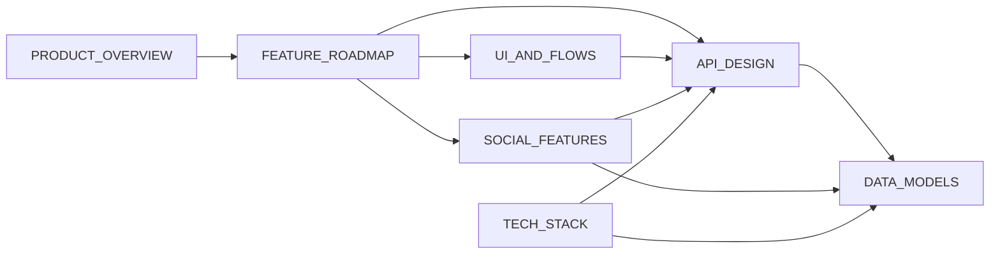

# Log It — Documentation Maintenance Workflow

## Overview

The `docs/` folder contains the planning documentation suite for the Log It app. **Every time a feature is added, changed, or removed, the relevant docs must be updated to stay in sync.**

This is the single source of truth for what we're building and how.

---

## Documentation Files

| File | Purpose | Update When... |
|---|---|---|
| [`PRODUCT_OVERVIEW.md`](file:///Users/jonahrothman/Desktop/Workspace/LogIt/docs/PRODUCT_OVERVIEW.md) | Vision, positioning, MVP scope, future direction | Product scope changes, MVP goals shift, new verticals added |
| [`DATA_MODELS.md`](file:///Users/jonahrothman/Desktop/Workspace/LogIt/docs/DATA_MODELS.md) | Database schema, entity relationships, indexes | Any field added/removed/renamed, new entities, query patterns change |
| [`TECH_STACK.md`](file:///Users/jonahrothman/Desktop/Workspace/LogIt/docs/TECH_STACK.md) | Technology choices, architecture, project structure | New dependency added, backend decision made, folder structure changes |
| [`UI_AND_FLOWS.md`](file:///Users/jonahrothman/Desktop/Workspace/LogIt/docs/UI_AND_FLOWS.md) | Screens, navigation, user flows, design system | New screen added, flow changes, navigation restructured, design tokens updated |
| [`API_DESIGN.md`](file:///Users/jonahrothman/Desktop/Workspace/LogIt/docs/API_DESIGN.md) | API endpoints, request/response contracts, errors | New endpoint, field changes, auth changes, error codes added |
| [`FEATURE_ROADMAP.md`](file:///Users/jonahrothman/Desktop/Workspace/LogIt/docs/FEATURE_ROADMAP.md) | Phased feature breakdown, priority matrix, checklists | Feature completed, reprioritized, new feature added, moved between phases |
| [`SOCIAL_FEATURES.md`](file:///Users/jonahrothman/Desktop/Workspace/LogIt/docs/SOCIAL_FEATURES.md) | Social layer design, privacy model, friend system | Privacy rules change, social features added/scoped, notification behavior changes |
| [`EXTERNAL_SERVICES.md`](file:///Users/jonahrothman/Desktop/Workspace/LogIt/docs/EXTERNAL_SERVICES.md) | External APIs, data ingestion strategies per event type | New external API added, ingestion strategy changes, media source changes |
| [`ADMIN_DASHBOARD.md`](file:///Users/jonahrothman/Desktop/Workspace/LogIt/docs/ADMIN_DASHBOARD.md) | Admin portal features, venue enrichment, RLS policies | Admin UI changes, new data tabs, enrichment logic changes |

---

## Update Rules

### Always Do
1. **Update the `Last updated` date AND append a new changelog entry** at the top of any doc you modify. **Do NOT delete previous changelog entries — keep a running log.** Format:
   ```
   > **Last updated:** 2026-03-28
   > **Changes:**
   > - 2026-03-28: Added Search/Explore tab, updated nav graph
   > - 2026-03-26: Added companions to log creation, moved comments to MVP
   > - 2026-03-24: Initial document creation
   ```
   New entries go at the top of the list (newest first). Each entry should be a single line with the date and a brief summary of what changed.
2. **Keep the feature roadmap checklists current** — mark `[x]` when a feature is implemented
3. **Update the data model** whenever a database field or entity changes
4. **Update the API doc** whenever an endpoint is added or its contract changes
5. **Keep the tech stack doc in sync** with actual dependencies in `package.json`

### Cross-Doc Updates

Some changes require updating multiple docs:

| Change | Docs to Update |
|---|---|
| New screen added | `UI_AND_FLOWS.md`, `API_DESIGN.md` (if new endpoint needed), `FEATURE_ROADMAP.md` |
| New database field | `DATA_MODELS.md`, `API_DESIGN.md` (response shapes) |
| New feature implemented | `FEATURE_ROADMAP.md` (check it off), possibly `UI_AND_FLOWS.md` and `API_DESIGN.md` |
| Tech decision made | `TECH_STACK.md`, remove from open questions in `PRODUCT_OVERVIEW.md` |
| Privacy rule changed | `SOCIAL_FEATURES.md`, `API_DESIGN.md` |
| New social feature | `SOCIAL_FEATURES.md`, `FEATURE_ROADMAP.md`, `UI_AND_FLOWS.md`, `API_DESIGN.md` |
| Notification behavior changed | `SOCIAL_FEATURES.md`, `API_DESIGN.md`, `DATA_MODELS.md` |
| Photo handling changed | `UI_AND_FLOWS.md`, `API_DESIGN.md`, `DATA_MODELS.md` |
| Admin portal updated | `ADMIN_DASHBOARD.md`, `TECH_STACK.md`, `FEATURE_ROADMAP.md` |
| Venue enrichment changed | `ADMIN_DASHBOARD.md`, `EXTERNAL_SERVICES.md`, `DATA_MODELS.md` |
| New sport / event type added | `docs/event-types/sports.md`, `FEATURE_ROADMAP.md`, `EXTERNAL_SERVICES.md`, `README.md` |

### README Updates

The project `README.md` is the **front-facing** presentation of the repo. It should be checked on any major change:

- **When to update:** New sport added, major feature shipped, tech stack changed, new docs created
- **What to update:** Features table, Tech Stack table, Architecture tree, Documentation table, Status section
- **Changelog:** Add a row to the Changelog table at the bottom of the README with the date and a one-line summary. This is for presentation purposes — README only.
- **Keep minimal:** Only update the README for externally visible or structurally significant changes. Internal refactors or doc-only changes do not need a README update.

### Format Consistency
- Use tables for structured comparisons
- Use Mermaid diagrams for flows and relationships
- Use checklists (`- [ ]` / `- [x]`) for trackable items
- Use code blocks for API request/response examples
- Keep each doc self-contained — a reader should understand it without reading all others

---

## When to Create New Docs

If the project expands into a new major area not covered by the existing docs, create a new file in `docs/` and add it to this workflow's table above. Examples of when this might happen:

- A dedicated **testing strategy** doc when test infrastructure is set up
- A **deployment & infrastructure** doc when CI/CD is configured
- A **content moderation** doc if user-generated content policies are needed

### Event Type Workflows (`docs/event-types/`)

The `docs/event-types/` subfolder contains step-by-step workflow docs for adding new event types. Each event category gets its own file:

| File | Purpose |
|---|---|
| [`sports.md`](file:///Users/jonahrothman/Desktop/Workspace/LogIt/docs/event-types/sports.md) | Adding new sports leagues (ESPN sync, venues, team arrays, cron config) |
| `movies.md` (future) | Adding movie ingestion (TMDB API) |
| `concerts.md` (future) | Adding concert ingestion (Ticketmaster API) |

These are living documents — update them each time a new event type or league is added. They track which types are implemented and provide the exact file checklist for adding new ones.

---

## Quick Reference: Doc Relationships



Product decisions flow into the roadmap, which drives UI screens, API endpoints, and social features. The API and social features connect back to the data model. The tech stack underpins the API and data layers.
