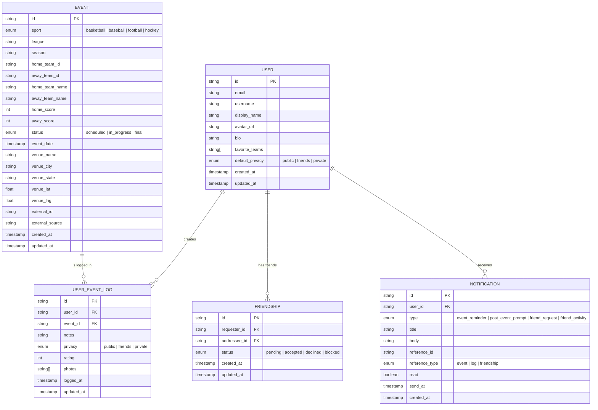

# Log It — Data Models

> **Last updated:** 2026-03-26

## Design Principles

1. **Canonical events are shared** — One game = one record. Many users attach to it.
2. **User data is personal** — Logs, notes, and privacy settings belong to the user.
3. **Separation of concerns** — Event metadata vs. user attendance vs. social graph are distinct.
4. **Extensible** — Schema should accommodate future event types (concerts, movies) without major rewrites.

---

## Entity Relationship Diagram

---

## Entity Details

### `User`

The person using the app.

| Field | Type | Description |
|---|---|---|
| `id` | string (UUID) | Primary key |
| `email` | string | Unique, from auth provider |
| `username` | string | Unique handle (e.g., `@jonah`) |
| `display_name` | string | Shown in feed and profile |
| `avatar_url` | string | Profile photo URL |
| `bio` | string | Optional short bio |
| `favorite_teams` | string[] | Team IDs the user follows |
| `default_privacy` | enum | Default log visibility: `public`, `friends`, `private` |
| `created_at` | timestamp | Account creation |
| `updated_at` | timestamp | Last profile update |

### `Event`

A canonical sports game. One record per real-world game.

| Field | Type | Description |
|---|---|---|
| `id` | string (UUID) | Primary key |
| `sport` | enum | `basketball`, `baseball`, `football`, `hockey` |
| `league` | string | `NBA`, `MLB`, `NFL`, `NHL` |
| `season` | string | e.g., `2025-26` |
| `home_team_id` | string | Reference to team |
| `away_team_id` | string | Reference to team |
| `home_team_name` | string | Denormalized for display |
| `away_team_name` | string | Denormalized for display |
| `home_score` | int | Final or current score |
| `away_score` | int | Final or current score |
| `status` | enum | `scheduled`, `in_progress`, `final` |
| `event_date` | timestamp | Game date and time |
| `venue_name` | string | Arena/stadium name |
| `venue_city` | string | City |
| `venue_state` | string | State |
| `venue_lat` | float | Latitude for map features |
| `venue_lng` | float | Longitude for map features |
| `external_id` | string | ID from source API (e.g., ESPN game ID) |
| `external_source` | string | Which API sourced this event |
| `created_at` | timestamp | Record creation |
| `updated_at` | timestamp | Last data refresh |

### `UserEventLog`

The user's personal attendance record for an event.

| Field | Type | Description |
|---|---|---|
| `id` | string (UUID) | Primary key |
| `user_id` | string (FK) | Who logged it |
| `event_id` | string (FK) | Which event (nullable for manual entries) |
| `notes` | string | User's personal notes |
| `privacy` | enum | `public`, `friends`, `private` |
| `rating` | int | Optional 1-5 rating of the experience |
| `photos` | string[] | Optional photo URLs |
| `logged_at` | timestamp | When the user created this log |
| `updated_at` | timestamp | Last edit |

### `Friendship`

Bidirectional friend relationship.

| Field | Type | Description |
|---|---|---|
| `id` | string (UUID) | Primary key |
| `requester_id` | string (FK) | Who sent the request |
| `addressee_id` | string (FK) | Who received the request |
| `status` | enum | `pending`, `accepted`, `declined`, `blocked` |
| `created_at` | timestamp | Request sent |
| `updated_at` | timestamp | Last status change |

---

## Future Entities (Post-MVP)

| Entity | Purpose |
|---|---|
| `Team` | Normalized team data (name, logo, colors, sport, venue) |
| `Venue` | Normalized venue data (name, city, capacity, geo) |
| `Comment` | Comments on a UserEventLog |
| `Reaction` | Reactions (likes, emoji) on a UserEventLog |
| `ManualEvent` | User-created events not in the canonical DB |
| `EventEntity` | Repeatable entity (artist, movie, team) that links to multiple Event Instances — for event discovery & reviews |

---

## Indexes & Query Patterns

| Query | Fields Indexed | Priority |
|---|---|---|
| User's logbook (all logs) | `user_event_log.user_id` + `logged_at` | MVP |
| Filter by sport | `event.sport` | MVP |
| Filter by team | `event.home_team_id`, `event.away_team_id` | MVP |
| Filter by date range | `event.event_date` | MVP |
| Filter by venue | `event.venue_name` | MVP |
| Feed (public logs) | `user_event_log.privacy` + `logged_at` | MVP |
| Friends' logs | `friendship.status` + `user_event_log.user_id` | v1.5 |
| Shared attendance | `user_event_log.event_id` (multiple users) | v2 |
| Geo/map queries | `event.venue_lat`, `event.venue_lng` | v1.5 |
