# Log It — Data Models

> **Last updated:** 2026-04-11
> **Changes:**
> - 2026-04-11: Added `rooted_team` column to `user_event_logs` (migration 019). Users can now pick which team they rooted for — W/L badge logic uses this instead of defaulting to home team. Reverted internal league identifiers back to NCAAM/NCAAW (UI-only display maps these to NCAAMB/NCAAWB). Hidden box score for college hockey/baseball (ESPN has no data).
> - 2026-03-31: Added `season_type` and `round` columns to `sports_events` (migration 015). Added anon UPDATE policy on `venues` (migration 014). Updated ERD and entity details.
> - 2026-03-31: Added anon SELECT policies on `events` and `sports_events` (migration 013) for admin portal access. Updated Venue entity to reflect auto-enrichment via Nominatim + Wikimedia Commons.
> - 2026-03-30: Added `log_photos` table (migration 012). Replaced stale `string[] photos` column on `user_event_logs` with proper FK relationship to `log_photos`. Updated ERD.
> - 2026-03-29: Added implemented `Venue` entity (migration 008). Added `venue_id` FK on `events`. Added `nightlife` to event_type enum in entity details.
> - 2026-03-29: Added `home_team_logo` and `away_team_logo` columns to `sports_events` for ESPN API caching compliance.
> - 2026-03-28: `events`, `sports_events`, `user_event_logs`, `log_companions` tables now **implemented** (migrations 003-006). Full-text search index on events. Venue fields (name, state, lat, lng) populated via static NBA venue mapping.
> - 2026-03-28: Clarified that Manual events are specifically a fallback when canonical API search fails.
> - 2026-03-27: Added `nightlife_events` child table for clubs/bars/nights out

## Design Principles

1. **Canonical events are shared** — One event = one record. Many users attach to it.
2. **User data is personal** — Logs, notes, and privacy settings belong to the user.
3. **Separation of concerns** — Event metadata vs. user attendance vs. social graph are distinct.
4. **Polymorphic events via child tables** — A shared `events` base table with type-specific child tables (`sports_events`, `movie_events`, etc.) for clean normalization and scalability.
5. **Extensible** — Adding a new event type means creating a new child table — no existing tables change.

---

## Entity Relationship Diagram

```mermaid
erDiagram
    USER ||--o{ USER_EVENT_LOG : creates
    EVENT ||--o{ USER_EVENT_LOG : "is logged in"
    USER_EVENT_LOG ||--o{ LOG_PHOTO : "has photos"
    USER ||--o{ FRIENDSHIP : "has friends"
    USER ||--o{ NOTIFICATION : receives
    USER_EVENT_LOG ||--o{ COMMENT : "has comments"
    USER_EVENT_LOG ||--o{ LOG_COMPANION : "has companions"
    EVENT ||--o| SPORTS_EVENT : "extends (sports)"
    EVENT ||--o| MOVIE_EVENT : "extends (movie)"
    EVENT ||--o| CONCERT_EVENT : "extends (concert)"
    EVENT ||--o| RESTAURANT_EVENT : "extends (restaurant)"
    EVENT ||--o| NIGHTLIFE_EVENT : "extends (nightlife)"
    EVENT }o--o| VENUE : "hosted at"
    USER {
        uuid id PK
        string email
        string username
        string first_name
        string last_name
        string display_name
        string avatar_url
        string bio
        string[] event_preferences
        enum default_privacy
        timestamp created_at
        timestamp updated_at
    }
    EVENT {
        uuid id PK
        enum event_type "sports | movie | concert | restaurant | nightlife | manual"
        string title
        enum status "upcoming | in_progress | completed"
        timestamp event_date
        string venue_name
        string venue_city
        string venue_state
        float venue_lat
        float venue_lng
        string image_url
        uuid venue_id FK "nullable - normalized venue"
        string external_id
        string external_source
        timestamp created_at
        timestamp updated_at
    }
    SPORTS_EVENT {
        uuid event_id FK
        enum sport "basketball | baseball | football | hockey"
        string league
        string season
        int season_type "1=preseason 2=regular 3=postseason 4=offseason 5=allstar"
        string round "nullable - playoff round name"
        string home_team_id
        string away_team_id
        string home_team_name
        string away_team_name
        string home_team_logo
        string away_team_logo
        int home_score
        int away_score
    }
    MOVIE_EVENT {
        uuid event_id FK
        string genre
        string director
        int runtime_minutes
        string tmdb_id
        string[] cast
    }
    CONCERT_EVENT {
        uuid event_id FK
        string artist
        string tour_name
        string genre
        string ticketmaster_id
        string opener
    }
    RESTAURANT_EVENT {
        uuid event_id FK
        string cuisine
        string price_level
        string foursquare_id
    }
    NIGHTLIFE_EVENT {
        uuid event_id FK
        enum venue_type "club | bar | lounge | rooftop | pub"
        string vibe
        string dress_code
        string music_genre
        string price_level
        string google_place_id
    }
    USER_EVENT_LOG {
        uuid id PK
        uuid user_id FK
        uuid event_id FK
        string notes
        enum privacy "public | friends | private"
        float rating
        string rooted_team "home | away | null"
        timestamp logged_at
        timestamp updated_at
    }
    LOG_PHOTO {
        uuid id PK
        uuid log_id FK
        uuid user_id FK
        string firebase_path "path in Firebase Storage for deletion"
        string url "Firebase public download URL"
        int display_order
        timestamp created_at
    }
    LOG_COMPANION {
        uuid id PK
        uuid log_id FK
        uuid user_id FK "nullable - linked friend"
        string name "freeform name if no account"
    }
    COMMENT {
        uuid id PK
        uuid log_id FK
        uuid user_id FK
        string text
        timestamp created_at
    }
    FRIENDSHIP {
        uuid id PK
        uuid requester_id FK
        uuid addressee_id FK
        enum status "pending | accepted | declined | blocked"
        timestamp created_at
        timestamp updated_at
    }
    NOTIFICATION {
        uuid id PK
        uuid user_id FK
        enum type "event_reminder | post_event_prompt | friend_request | friend_activity | comment | companion_tagged"
        string title
        string body
        uuid reference_id
        enum reference_type "event | log | friendship | comment"
        boolean read
        timestamp send_at
        timestamp created_at
    }
```

---

## Entity Details

### `User`

The person using the app.

| Field | Type | Description |
|---|---|---|
| `id` | UUID | Primary key |
| `email` | string | Unique, from auth provider |
| `username` | string | Unique handle (e.g., `@jonah`) — **publicly visible** |
| `first_name` | string | User's first name — **friends + self only** |
| `last_name` | string | User's last name — **friends + self only** |
| `display_name` | string | Shown in feed and profile |
| `avatar_url` | string | Profile photo URL |
| `bio` | string | Optional short bio |
| `event_preferences` | string[] | Event types the user is interested in (e.g., `["sports", "movies"]`) |
| `default_privacy` | enum | Default log visibility: `public`, `friends`, `private` |
| `created_at` | timestamp | Account creation |
| `updated_at` | timestamp | Last profile update |

### `Event` (Base Table)

The shared base for all event types. One record per real-world event.

| Field | Type | Description |
|---|---|---|
| `id` | UUID | Primary key |
| `event_type` | enum | `sports`, `movie`, `concert`, `restaurant`, `nightlife`, `manual` |
| `title` | string | Display title (e.g., "Lakers vs Celtics", "Oppenheimer") |
| `status` | enum | `upcoming`, `in_progress`, `completed` |
| `event_date` | timestamp | Event date and time |
| `venue_name` | string | Venue/location name |
| `venue_city` | string | City |
| `venue_state` | string | State |
| `venue_lat` | float | Latitude for map features |
| `venue_lng` | float | Longitude for map features |
| `image_url` | string | Primary image (team logo, movie poster, artist photo) |
| `venue_id` | UUID (FK, nullable) | Reference to `venues` table (if venue is normalized) |
| `external_id` | string | ID from source API |
| `external_source` | string | Which API sourced this event |
| `created_at` | timestamp | Record creation |
| `updated_at` | timestamp | Last data refresh |

### Child Tables (Type-Specific Metadata)

Each child table has a **1:1 relationship** with `events` via `event_id` foreign key.

#### `SportsEvent`

| Field | Type | Description |
|---|---|---|
| `event_id` | UUID (FK → events) | Primary key, references base event |
| `sport` | enum | `basketball`, `baseball`, `football`, `hockey` |
| `league` | string | `NBA`, `WNBA`, `MLB`, `NFL`, `NHL`, `NCAAF`, `NCAAM`, `NCAAW`, `NCAAMH`, `NCAAWH`, `NCAABS` |
| `season` | string | e.g., `2025-26` |
| `season_type` | int | ESPN type: `1` (preseason), `2` (regular), `3` (postseason), `4` (offseason), `5` (all-star) |
| `round` | string (nullable) | Playoff round name (e.g., "NBA Finals", "Super Bowl") |
| `home_team_id` | string | Reference to team |
| `away_team_id` | string | Reference to team |
| `home_team_name` | string | Denormalized for display |
| `away_team_name` | string | Denormalized for display |
| `home_team_logo` | string | ESPN high-res logo URL |
| `away_team_logo` | string | ESPN high-res logo URL |
| `home_score` | int | Final or current score |
| `away_score` | int | Final or current score |

#### `MovieEvent`

| Field | Type | Description |
|---|---|---|
| `event_id` | UUID (FK → events) | Primary key, references base event |
| `genre` | string | Primary genre |
| `director` | string | Director name |
| `runtime_minutes` | int | Film length |
| `tmdb_id` | string | TMDB API identifier |
| `cast` | string[] | Major cast members |
| `watched_at` | string | Where watched: `Theater`, `Home`, `Drive-In`, `Streaming` |
| `theater_name` | string | Theater name (e.g., "AMC Lincoln Square") |

#### `ConcertEvent`

| Field | Type | Description |
|---|---|---|
| `event_id` | UUID (FK → events) | Primary key, references base event |
| `artist` | string | Primary performer |
| `tour_name` | string | Tour name if applicable |
| `genre` | string | Music genre |
| `ticketmaster_id` | string | Ticketmaster event ID |
| `opener` | string | Opening act |
| `setlist` | string[] | Setlist highlights |

#### `RestaurantEvent`

| Field | Type | Description |
|---|---|---|
| `event_id` | UUID (FK → events) | Primary key, references base event |
| `cuisine` | string | Cuisine type |
| `price_level` | string | Price indicator (`$`, `$$`, `$$$`, `$$$$`) |
| `foursquare_id` | string | Foursquare venue ID |

#### `ManualEvent` (Fallback)

For user-created events not found in any external database API search. Uses the base `events` fields only (title, date, venue, notes). No child table needed — `event_type = 'manual'` with no child row. This ensures users are never truly blocked from logging, but it lacks the canonical overlap of API events.

#### `NightlifeEvent` (future)

| Field | Type | Description |
|---|---|---|
| `event_id` | UUID (FK → events) | Primary key, references base event |
| `venue_type` | enum | `club`, `bar`, `lounge`, `rooftop`, `pub` |
| `vibe` | string | Vibe description (e.g., "chill", "high-energy", "underground") |
| `dress_code` | string | Dress code if applicable |
| `music_genre` | string | Music genre (e.g., "house", "hip-hop", "live DJ") |
| `price_level` | string | Price indicator (`$`, `$$`, `$$$`, `$$$$`) |
| `google_place_id` | string | Google Places ID for venue lookup |

> **Social angle:** Nightlife is inherently social — most logs will tag companions and be shared with friends. Venue discovery ("have my friends been here?", browse photos/ratings before going out) is a natural fit for the existing companion + feed infrastructure.

### `UserEventLog`

The user's personal attendance record for an event.

| Field | Type | Description |
|---|---|---|
| `id` | UUID | Primary key |
| `user_id` | UUID (FK) | Who logged it |
| `event_id` | UUID (FK) | Which event (nullable for manual entries) |
| `notes` | string | User's personal notes |
| `privacy` | enum | `public`, `friends`, `private` |
| `rating` | float | Optional 0.5–5 rating of the experience (half-star increments) |
| `rooted_team` | string (nullable) | Which team the user rooted for: `home`, `away`, or `null`. Determines W/L badge display. |
| `photos` | string[] | Optional photo URLs |
| `logged_at` | timestamp | When the user created this log |
| `updated_at` | timestamp | Last edit |

### `LogCompanion`

Who the user went with. Can be a linked friend or a freeform name.

| Field | Type | Description |
|---|---|---|
| `id` | UUID | Primary key |
| `log_id` | UUID (FK) | Which log entry |
| `user_id` | UUID (FK, nullable) | Linked friend account (null if freeform) |
| `name` | string | Display name — auto-filled from user profile if linked, freeform otherwise |

> **Reassignment:** When a companion later creates an account, the user can edit the companion entry to link the `user_id`, converting a freeform name into a linked friend.

### `Comment`

Comments on a user's log entry (MVP).

| Field | Type | Description |
|---|---|---|
| `id` | UUID | Primary key |
| `log_id` | UUID (FK) | Which log entry |
| `user_id` | UUID (FK) | Who wrote the comment |
| `text` | string | Comment text |
| `created_at` | timestamp | When posted |

### `Friendship`

Bidirectional friend relationship.

| Field | Type | Description |
|---|---|---|
| `id` | UUID | Primary key |
| `requester_id` | UUID (FK) | Who sent the request |
| `addressee_id` | UUID (FK) | Who received the request |
| `status` | enum | `pending`, `accepted`, `declined`, `blocked` |
| `created_at` | timestamp | Request sent |
| `updated_at` | timestamp | Last status change |

### `Notification`

| Field | Type | Description |
|---|---|---|
| `id` | UUID | Primary key |
| `user_id` | UUID (FK) | Who receives it |
| `type` | enum | `event_reminder`, `post_event_prompt`, `friend_request`, `friend_activity`, `comment`, `companion_tagged` |
| `title` | string | Notification title |
| `body` | string | Notification body text |
| `reference_id` | UUID | ID of related entity |
| `reference_type` | enum | `event`, `log`, `friendship`, `comment` |
| `read` | boolean | Read status |
| `send_at` | timestamp | Scheduled send time (for reminders) |
| `created_at` | timestamp | Record creation |

---

## Implemented Entities

### `Venue` (Migration 008)

Normalized venue data. 30 NBA home arenas seeded with full metadata; additional venues auto-created when sync scripts encounter new locations (preseason sites, international venues, etc.).

**Auto-enrichment:** When `findOrCreateVenue()` inserts a new venue, it automatically enriches it via Nominatim (lat/lng) and Wikimedia Commons (image). Existing venues with null metadata can be backfilled via `api/scripts/backfill-venues.ts`.

| Field | Type | Description |
|---|---|---|
| `id` | UUID | Primary key |
| `name` | string | Venue name |
| `city` | string | City |
| `state` | string | State |
| `country` | string | Country (default: `US`) |
| `lat` | float | Latitude (auto-enriched via Nominatim) |
| `lng` | float | Longitude (auto-enriched via Nominatim) |
| `image_url` | string | Venue photo (auto-enriched via Wikimedia Commons) |
| `venue_type` | string | `arena`, `stadium`, `theater`, `restaurant`, `bar`, `club`, `other` |
| `capacity` | int | Venue capacity |
| `external_id` | string | External reference ID |
| `external_source` | string | Source of external ID (`nba` for seeded arenas, null for auto-created) |
| `created_at` | timestamp | Record creation |
| `updated_at` | timestamp | Last update |

> **RLS:** Migration 013 adds anon SELECT policies on `events` and `sports_events` so the admin portal can read game data without authentication. Migration 014 adds anon UPDATE on `venues` for enrichment scripts. Venue data has no RLS (public by default).

---

## Future Entities (Post-MVP)

| Entity | Purpose |
|---|---|
| `Team` | Normalized team data (name, logo URL, colors, sport, venue) — stored locally in Supabase |
| `Venue` | Normalized venue data (name, city, capacity, geo) |
| `Reaction` | Reactions (likes, emoji) on a UserEventLog |
| `EventEntity` | Repeatable entity (artist, movie, team) that links to multiple Event Instances — for event discovery & reviews |

---

## Indexes & Query Patterns

| Query | Fields Indexed | Priority |
|---|---|---|
| User's logbook (all logs) | `user_event_log(user_id, logged_at)` | MVP |
| Filter by event type | `event(event_type)` | MVP |
| Filter by date range | `event(event_date)` | MVP |
| Filter by venue | `event(venue_name)` | MVP |
| Full-text search (title, venue) | GIN index on `event(title, venue_name)` using `tsvector` | MVP |
| Feed (public logs) | `user_event_log(privacy, logged_at)` | MVP |
| Filter by sport (type-specific) | `sports_event(sport)` | MVP |
| Filter by team | `sports_event(home_team_id)`, `sports_event(away_team_id)` | MVP |
| Filter by league | `sports_event(league)` | MVP |
| Event-to-venue join | `event(venue_id)` | MVP |
| Venue name search (trigram) | GIN index on `venue(name)` using `gin_trgm_ops` | MVP |
| Comments on a log | `comment(log_id, created_at)` | MVP |
| Companions of a log | `log_companion(log_id)` | MVP |
| Friends' logs | `friendship(status)` + `user_event_log(user_id)` | v1.5 |
| Shared attendance | `user_event_log(event_id)` (multiple users) | v2 |
| Geo/map queries | `event(venue_lat, venue_lng)` | v1.5 |
| Movie search | `movie_event(tmdb_id)`, `movie_event(genre)` | Future |
| Concert search | `concert_event(artist)`, `concert_event(ticketmaster_id)` | Future |
| Restaurant search | `restaurant_event(cuisine)`, `restaurant_event(foursquare_id)` | Future |
