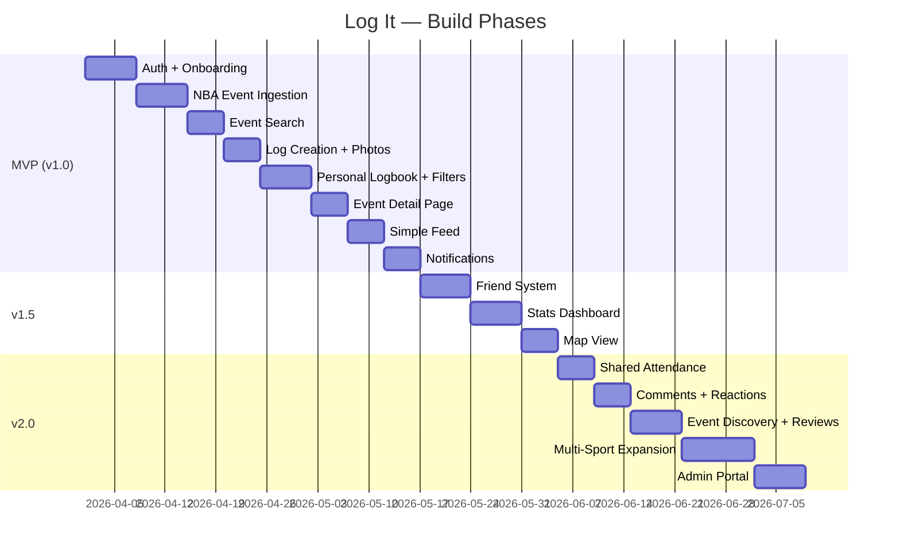

# Log It — Feature Roadmap

> **Last updated:** 2026-03-26

## Build Phases

---

## MVP (v1.0) — Core Product

> **Goal:** A user can sign up, find a game, log it, and browse their history.

### 1. Auth & Onboarding
- [ ] Email + password sign-up/sign-in
- [ ] Google OAuth
- [ ] Apple OAuth
- [ ] Username selection
- [ ] Favorite team picker
- [ ] Profile creation (display name, avatar)

### 2. Sports Event Data (NBA First)
- [ ] Integrate Ball Don't Lie API for NBA games
- [ ] Vercel cron function for scheduled ingestion (daily sync)
- [ ] Store canonical `Event` records in Supabase Postgres
- [ ] Deduplication via `external_id`
- [ ] Post-game score/status updates

### 3. Event Search
- [ ] Full-text search (team names, venue)
- [ ] Filter by sport, team, date range
- [ ] Paginated results
- [ ] "Game not found" → manual entry fallback

### 4. Log Creation
- [ ] Select game from search results
- [ ] Add optional notes
- [ ] Set privacy (public / friends / private)
- [ ] Optional star rating (1-5)
- [ ] Photo upload (up to a few per log, stored in Supabase Storage)
- [ ] Success confirmation with animation
- [ ] Prevent duplicate logs for same event

### 5. Personal Logbook
- [ ] Unified list of all logs, newest first
- [ ] Filter by: sport, team, date range, venue, privacy
- [ ] Active filters shown as removable chips
- [ ] Total count header ("47 events logged")
- [ ] Tap to view event detail

### 6. Event Detail Page
- [ ] Game header (teams, score, status)
- [ ] Date, time, venue with map link
- [ ] User's attendance badge + notes + rating
- [ ] Edit/delete log from this screen

### 7. Simple Feed
- [ ] "You" tab — own activity as a feed
- [ ] "Everyone" tab — all public logs
- [ ] Each post shows: user, event, date, notes
- [ ] Tap card → event detail
- [ ] Pull-to-refresh
- [ ] Empty states for first-time users

### 8. Notifications (MVP)
- [ ] Upcoming event countdown reminders
- [ ] Post-event prompt to log attendance
- [ ] In-app notification center
- [ ] Push notification infrastructure (Firebase Cloud Messaging)

---

## v1.5 — Social & Stats

> **Goal:** Friends, stats, and the map unlock the "wow" features.

### 8. Friend System
- [ ] Search users by username
- [ ] Send/accept/decline friend requests
- [ ] Friends list management
- [ ] "Friends" tab in feed (shows friends' public + friends-only logs)
- [ ] Friend suggestions (later, from event overlap)

### 9. Stats Dashboard
- [ ] Total games attended
- [ ] Favorite team (by attendance count)
- [ ] Win/loss record when attending
- [ ] Most visited venue
- [ ] Attendance by sport breakdown
- [ ] Games per month/year chart
- [ ] Attendance timeline

### 10. Map View
- [ ] Map of all venues attended
- [ ] Pins with attendance count per venue
- [ ] Tap pin → list of games at that venue
- [ ] Attendance by city/state

### 11. Additional Sports
- [ ] Add MLB support
- [ ] Add NFL support
- [ ] Add NHL support
- [ ] Multi-sport filter in logbook and feed

---

## v2.0 — Social Depth & Expansion

> **Goal:** The app becomes social-first and opens beyond sports.

### 12. Shared Attendance
- [ ] "Also attended" section on event detail
- [ ] Notification: "You and @mike were both at this game"
- [ ] Mutual attendance stats with friends
- [ ] Shared absentee detection ("You both missed this one")

### 13. Comments & Reactions
- [ ] Comment on any public log
- [ ] Emoji reactions (🔥 🏀 👏 etc.)
- [ ] Notification for comments/reactions on your logs

### 14. Event Discovery & Reviews
- [ ] Event detail pages become discovery surfaces
- [ ] Aggregated reviews, photos, and sentiment from attendees
- [ ] "See what people said" section
- [ ] Support for Event Entity vs. Event Instance model

### 15. Beyond Sports
- [ ] Concerts
- [ ] Movies / Theater
- [ ] Restaurants
- [ ] Custom/manual events
- [ ] Generic "experience" event type

### 16. Advanced Features
- [ ] Share log as image/story
- [ ] Annual recap / "Year in Review"
- [ ] Achievement badges
- [ ] Profile customization (banner, theme)

### 17. Admin Portal
- [ ] Custom admin dashboard (Next.js)
- [ ] User management and moderation
- [ ] Content review tools
- [ ] Growth and activity analytics

---

## Priority Matrix

| Feature | Impact | Effort | Priority |
|---|---|---|---|
| Auth + Onboarding | 🔴 High | 🟡 Medium | **P0 — MVP** |
| Event Ingestion (NBA) | 🔴 High | 🟡 Medium | **P0 — MVP** |
| Log Creation + Photos | 🔴 High | 🟡 Medium | **P0 — MVP** |
| Logbook + Filters | 🔴 High | 🟡 Medium | **P0 — MVP** |
| Event Detail | 🟡 Medium | 🟢 Low | **P0 — MVP** |
| Feed | 🟡 Medium | 🟡 Medium | **P0 — MVP** |
| Notifications | 🟡 Medium | 🟡 Medium | **P0 — MVP** |
| Friend System | 🟡 Medium | 🟡 Medium | **P1 — v1.5** |
| Stats Dashboard | 🔴 High | 🟡 Medium | **P1 — v1.5** |
| Map View | 🔴 High | 🟡 Medium | **P1 — v1.5** |
| Shared Attendance | 🟡 Medium | 🟡 Medium | **P2 — v2.0** |
| Event Discovery | 🔴 High | 🔴 High | **P2 — v2.0** |
| Comments/Reactions | 🟢 Low | 🟢 Low | **P2 — v2.0** |
| Beyond Sports | 🔴 High | 🔴 High | **P2 — v2.0** |
| Admin Portal | 🟡 Medium | 🟡 Medium | **P2 — v2.0** |
