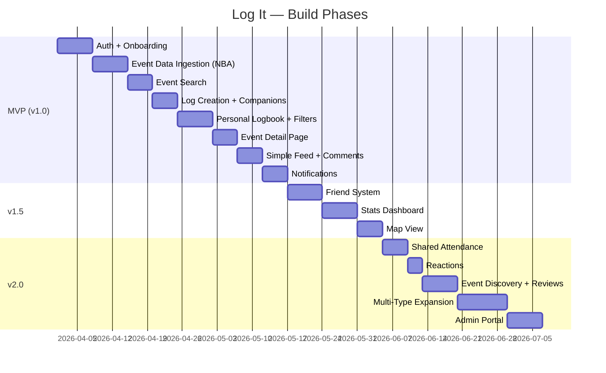

# Log It — Feature Roadmap

> **Last updated:** 2026-03-27
> Updated: Added nightlife (clubs, bars, nights out) as a future event type under v2.0

## Build Phases

---

## MVP (v1.0) — Core Product

> **Goal:** A user can sign up, find an event, log it, and browse their history. Starting with NBA games as the first event type, but the architecture supports all types from day one.

### 1. Auth & Onboarding
- [x] Email + password sign-up/sign-in
- [x] Google OAuth
- [x] Apple OAuth
- [x] Username selection
- [x] First name + last name collection
- [x] Profile creation (display name, avatar)
- [x] Event type preferences (choose which types you'll use: sports, movies, concerts, etc.)
- [x] Default privacy selection

### 2. Event Data (NBA First Implementation)
- [ ] Integrate Ball Don't Lie API for NBA games
- [ ] Vercel cron function for scheduled ingestion (daily sync)
- [ ] Store canonical `Event` records in Supabase Postgres (base table + `sports_events` child)
- [ ] Deduplication via `external_id`
- [ ] Post-game score/status updates
- [ ] Store sports team logos locally in Supabase Storage

### 3. Event Search
- [ ] Full-text search (title, venue, team names)
- [ ] Filter by event type, date range
- [ ] Type-specific filters (team, league, season for sports)
- [ ] Paginated results
- [ ] "Event not found" → manual entry fallback

### 4. Log Creation
- [ ] Select event from search results
- [ ] Add optional notes
- [ ] Set privacy (public / friends / private)
- [ ] Optional star rating (1-5)
- [ ] Photo upload (up to a few per log, stored in Supabase Storage)
- [ ] Add companions — tag friends or enter freeform names
- [ ] Success confirmation with animation
- [ ] Prevent duplicate logs for same event

### 5. Personal Logbook
- [ ] Unified list of all logs, newest first
- [ ] Filter by: event type, date range, venue, privacy, rating
- [ ] Type-specific filters when event type is selected (team, sport, etc.)
- [ ] Active filters shown as removable chips
- [ ] Total count header ("47 events logged")
- [ ] Tap to view event detail

### 6. Event Detail Page
- [ ] Event header (title, type-specific display — e.g., teams + score for sports)
- [ ] Date, time, venue with map link
- [ ] User's attendance badge + notes + rating + companions
- [ ] Edit/delete log from this screen
- [ ] Photos gallery

### 7. Simple Feed + Comments
- [ ] "You" tab — own activity as a feed
- [ ] "Everyone" tab — all public logs from the entire platform
- [ ] Each post shows: user, event, date, notes, rating, companion count, comment count
- [ ] Tap card → event detail
- [ ] Comments on any public log (post, read, delete)
- [ ] Pull-to-refresh
- [ ] Empty states for first-time users

### 8. Notifications (MVP)
- [ ] Upcoming event reminders (configurable timing: 24h, 2h, 30min before)
- [ ] Post-event prompt: add photos, rating, and notes after event concludes
- [ ] Companion tagged notification
- [ ] Comment notification
- [ ] In-app notification center
- [ ] Push notification infrastructure (Firebase Cloud Messaging)

---

## v1.5 — Social & Stats

> **Goal:** Friends, stats, and the map unlock the "wow" features.

### 9. Friend System
- [ ] Search users by username
- [ ] Send/accept/decline friend requests
- [ ] Friends list management
- [ ] "Friends" tab in feed (shows friends' public + friends-only logs)
- [ ] Friend suggestions (later, from event overlap)

### 10. Stats Dashboard
- [ ] Total events attended
- [ ] Breakdown by event type
- [ ] Favorite team / most-watched movie / most-seen artist (by attendance count)
- [ ] Win/loss record when attending (sports)
- [ ] Most visited venue
- [ ] Events per month/year chart
- [ ] Attendance timeline

### 11. Map View
- [ ] Map of all venues attended
- [ ] Pins with attendance count per venue
- [ ] Tap pin → list of events at that venue
- [ ] Attendance by city/state

### 12. Additional Sports
- [ ] Add MLB support (Ball Don't Lie or equivalent)
- [ ] Add NFL support
- [ ] Add NHL support
- [ ] Multi-sport filter in logbook and feed

---

## v2.0 — Social Depth & Expansion

> **Goal:** The app becomes social-first and opens beyond sports.

### 13. Shared Attendance
- [ ] "Also attended" section on event detail
- [ ] Notification: "You and @mike were both at this game"
- [ ] Mutual attendance stats with friends
- [ ] Shared absentee detection ("You both missed this one")

### 14. Reactions
- [ ] Emoji reactions on logs (🔥 🏀 👏 ❤️ etc.)
- [ ] Notification for reactions on your logs

### 15. Event Discovery & Reviews
- [ ] Event detail pages become discovery surfaces
- [ ] Aggregated reviews, photos, and sentiment from attendees
- [ ] "See what people said" section
- [ ] Support for Event Entity vs. Event Instance model

### 16. Beyond Sports — New Event Types
- [ ] Movies (TMDB API integration + `movie_events` child table)
- [ ] Concerts (Ticketmaster API integration + `concert_events` child table)
- [ ] Restaurants (Google Places / Foursquare integration + `restaurant_events` child table)
- [ ] Nightlife — clubs, bars, nights out (Google Places / Foursquare / Yelp + `nightlife_events` child table)
  - Venue discovery: see if friends have been, browse photos/reviews before going
  - Social-first: tag friends, shared group outings, public/private visibility
  - BeReal/Paparazzi-style social energy — logging nights out drives engagement
- [ ] Manual / custom events (no child table needed)
- [ ] Companion reassignment tool (link freeform names to new accounts)

### 17. Advanced Features
- [ ] Share log as image/story
- [ ] Annual recap / "Year in Review"
- [ ] Achievement badges
- [ ] Profile customization (banner, theme)

### 18. Admin Portal
- [ ] Custom admin dashboard (Next.js)
- [ ] User management and moderation
- [ ] Content review tools (photos, comments)
- [ ] Growth and activity analytics

---

## Priority Matrix

| Feature | Impact | Effort | Priority |
|---|---|---|---|
| Auth + Onboarding | 🔴 High | 🟡 Medium | **P0 — MVP** |
| Event Ingestion (NBA) | 🔴 High | 🟡 Medium | **P0 — MVP** |
| Log Creation + Companions | 🔴 High | 🟡 Medium | **P0 — MVP** |
| Logbook + Filters | 🔴 High | 🟡 Medium | **P0 — MVP** |
| Event Detail | 🟡 Medium | 🟢 Low | **P0 — MVP** |
| Feed + Comments | 🟡 Medium | 🟡 Medium | **P0 — MVP** |
| Notifications | 🟡 Medium | 🟡 Medium | **P0 — MVP** |
| Friend System | 🟡 Medium | 🟡 Medium | **P1 — v1.5** |
| Stats Dashboard | 🔴 High | 🟡 Medium | **P1 — v1.5** |
| Map View | 🔴 High | 🟡 Medium | **P1 — v1.5** |
| Shared Attendance | 🟡 Medium | 🟡 Medium | **P2 — v2.0** |
| Event Discovery | 🔴 High | 🔴 High | **P2 — v2.0** |
| Reactions | 🟢 Low | 🟢 Low | **P2 — v2.0** |
| Beyond Sports | 🔴 High | 🔴 High | **P2 — v2.0** |
| Admin Portal | 🟡 Medium | 🟡 Medium | **P2 — v2.0** |
