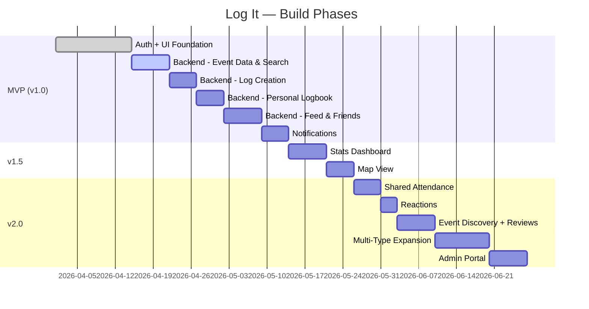

# Log It — Feature Roadmap

> **Last updated:** 2026-03-30
> **Changes:**
> - 2026-03-30: Checked off photo upload (Firebase Storage, log_photos table, compression, react-native-image-viewing viewer). Fixed stale Supabase Storage reference in log creation.
> - 2026-03-29: Checked off levenshtein search, search pagination, and sports team browse flow.
> - 2026-03-29: Added venue normalization and improved search (migrations 008–009) to Event Data & Search phase. Noted log deletion endpoint as implemented.

> - 2026-03-29: Marked Phase 4 (Log Creation) and Phase 5 (Personal Logbook) complete — API endpoints and UI fully wired for reading/writing logs.
> - 2026-03-28: Marked Phase 3 (Event Data & Search) complete — NBA cron sync, full-text search, venue enrichment, season backfill implemented. Added `EXTERNAL_SERVICES.md` reference. Added event countdown stretch goal to Notifications.
> - 2026-03-28: Consolidated completed UI foundation under MVP, reprioritized full backend execution (NBA Search, Real Log Creation, Logbook Fetching), and pulled Friend System into MVP for global feed filtering.
> - 2026-03-28: Clarified that Event Search queries real-world APIs (canonical objects), with manual entry as a fallback.
> - 2026-03-28: Added Search/Explore tab for discovering events and other users' logs. Event Detail Page with type-specific variants. Edit/Create Log Modal. Multi-type feed cards. Add Log screen with 6 event types.

## Build Phases

---

## MVP (v1.0) — Core Product

> **Goal:** A user can sign up, find an event (via real-world API search), log it, browse their history, and interact with friends in a global feed. Starting with NBA games as the first data type.

### 1. Auth & Onboarding
- [x] Email + password sign-up/sign-in
- [x] Google OAuth
- [x] Apple OAuth
- [x] Username selection
- [x] First name + last name collection
- [x] Profile creation (display name, avatar)
- [x] Event type preferences (choose which types you'll use: sports, movies, concerts, etc.)
- [x] Default privacy selection

### 2. UI & Mock Data Foundation
- [x] **Search / Explore:** Tab UI, search bar, type filter chips, trending events, recent searches, browse by category grid
- [x] **Personal Logbook:** Unified list UI, top counts, animated horizontal scroll filters, custom drop-down event sorting
- [x] **Feed Cards:** Polymorphic layout, type-specific secondary pills (score for sports, runtime for movies, price for dining)
- [x] **Event Detail Page:** Ticket-style modal, dynamic headers, user attendance badge, photo gallery, type-specific bottom content panels

### 3. Backend: Event Data & Search
- [x] Implement robust full-text search querying our Supabase `events` table (pre-ingested via cron)
- [x] Vercel cron function for scheduled ingestion (`api/cron/sync-nba.ts` — daily at 6 AM UTC)
- [x] Store canonical `Event` records and `sports_events` child records in Supabase Postgres
- [x] Deduplication via `external_id` + `external_source` unique index
- [x] Post-game score/status updates (cron updates existing rows)
- [x] Venue enrichment — static NBA arena mapping with name, city, state, lat/lng
- [x] Venue normalization — `venues` table (migration 008) with `venue_id` FK on `events`
- [x] Fuzzy/typo-tolerant search — `pg_trgm` trigram + `levenshtein` word-level + multi-token API splitting (migrations 009, 011)
- [x] Search pagination — 40 results/page, `offset` param, `has_more` flag, Load More button
- [x] Sports browse flow — Sports Hub → 30-team NBA logo grid → pre-filled team games
- [x] Season backfill endpoint (`api/cron/backfill-nba.ts`) for historical data
- [ ] "Event not found" → manual entry fallback (UI wired, backend pending)

### 4. Backend: Log Creation
- [x] Select real event from search results
- [x] Store user logs mapped to events in Supabase
- [x] Add optional notes, rating, companions — **implemented**
- [x] Photos — up to 5 per log, stored in **Firebase Storage**, compressed on-device (~350KB), with fullscreen swipe viewer (`react-native-image-viewing`); metadata in `log_photos` table
- [x] Add companions (tag friends or freeform)
- [x] Privacy configuration (public / friends / private)
- [x] Prevent duplicate logs for same event (or allow multiple attendances)

### 5. Backend: Personal Logbook
- [x] Fetch user's logs directly from Supabase
- [x] Apply real filters and sorting to the database query
- [x] Map backend rows backwards to the existing `EventDetail` TS type to power the unified Logbook UI

### 6. Backend: Simple Feed & Social
- [ ] Fetch public and friend-restricted logs for global feed
- [ ] "Following" / "For You" tabs working with real user data
- [ ] **Friend System:** Search users, send/accept requests, friend list management
- [ ] User profiles loading real feed history
- [ ] Comments on public logs (post, read, delete)

### 7. Notifications (MVP)
- [ ] Upcoming event reminders (configurable timing: 24h, 2h, 30min before)
- [ ] **Event countdown** — users who log future events see countdown on their logbook/profile
- [ ] Post-event prompt: add photos, rating, and notes after event concludes
- [ ] Companion tagged notification
- [ ] Comment notification
- [ ] In-app notification center
- [ ] Push notification infrastructure (Firebase Cloud Messaging)

> **Stretch goal:** Countdown notifications for future events (data already supports this — `events.status = 'upcoming'` with `event_date` in the future).

---

## v1.5 — Social & Stats

> **Goal:** Friends, stats, and the map unlock the "wow" features.

### 9. Friend System
- [ ] Search users by username
- [ ] Send/accept/decline friend requests
- [ ] Friends list management
- [ ] "Friends" tab in feed (shows friends' public + friends-only logs)
- [ ] Friend suggestions (later, from event overlap)

### 10. Stats Dashboard
- [ ] Total events attended
- [ ] Breakdown by event type
- [ ] Favorite team / most-watched movie / most-seen artist (by attendance count)
- [ ] Win/loss record when attending (sports)
- [ ] Most visited venue
- [ ] Events per month/year chart
- [ ] Attendance timeline

### 11. Map View
- [ ] Map of all venues attended
- [ ] Pins with attendance count per venue
- [ ] Tap pin → list of events at that venue
- [ ] Attendance by city/state

### 12. Additional Sports
- [ ] Add MLB support (ESPN API)
- [ ] Add NFL support
- [ ] Add NHL support
- [ ] Multi-sport filter in logbook and feed

---

## v2.0 — Social Depth & Expansion

> **Goal:** The app becomes social-first and opens beyond sports.

### 13. Shared Attendance
- [ ] "Also attended" section on event detail
- [ ] Notification: "You and @mike were both at this game"
- [ ] Mutual attendance stats with friends
- [ ] Shared absentee detection ("You both missed this one")

### 14. Reactions
- [ ] Emoji reactions on logs (🔥 🏀 👏 ❤️ etc.)
- [ ] Notification for reactions on your logs

### 15. Event Discovery & Reviews
- [ ] Event detail pages become discovery surfaces
- [ ] Aggregated reviews, photos, and sentiment from attendees
- [ ] "See what people said" section
- [ ] Support for Event Entity vs. Event Instance model

### 16. Beyond Sports — New Event Types
- [ ] Movies (TMDB API integration + `movie_events` child table)
- [ ] Concerts (Ticketmaster API integration + `concert_events` child table)
- [ ] Restaurants (Google Places / Foursquare integration + `restaurant_events` child table)
- [ ] Nightlife — clubs, bars, nights out (Google Places / Foursquare / Yelp + `nightlife_events` child table)
  - Venue discovery: see if friends have been, browse photos/reviews before going
  - Social-first: tag friends, shared group outings, public/private visibility
  - BeReal/Paparazzi-style social energy — logging nights out drives engagement
- [ ] Manual / custom events (no child table needed)
- [ ] Companion reassignment tool (link freeform names to new accounts)

### 17. Advanced Features
- [ ] Share log as image/story
- [ ] Annual recap / "Year in Review"
- [ ] Achievement badges
- [ ] Profile customization (banner, theme)

### 18. Admin Portal
- [ ] Custom admin dashboard (Next.js)
- [ ] User management and moderation
- [ ] Content review tools (photos, comments)
- [ ] Growth and activity analytics

---

## Priority Matrix

| Feature | Impact | Effort | Priority |
|---|---|---|---|
| Auth + Onboarding | 🔴 High | 🟡 Medium | **P0 — MVP** |
| Event Ingestion (NBA) | 🔴 High | 🟡 Medium | **P0 — MVP** |
| Log Creation + Companions | 🔴 High | 🟡 Medium | **P0 — MVP** |
| Logbook + Filters | 🔴 High | 🟡 Medium | **P0 — MVP** |
| Event Detail | 🟡 Medium | 🟢 Low | **P0 — MVP** |
| Feed + Comments | 🟡 Medium | 🟡 Medium | **P0 — MVP** |
| Notifications | 🟡 Medium | 🟡 Medium | **P0 — MVP** |
| Friend System | 🟡 Medium | 🟡 Medium | **P1 — v1.5** |
| Stats Dashboard | 🔴 High | 🟡 Medium | **P1 — v1.5** |
| Map View | 🔴 High | 🟡 Medium | **P1 — v1.5** |
| Shared Attendance | 🟡 Medium | 🟡 Medium | **P2 — v2.0** |
| Event Discovery | 🔴 High | 🔴 High | **P2 — v2.0** |
| Reactions | 🟢 Low | 🟢 Low | **P2 — v2.0** |
| Beyond Sports | 🔴 High | 🔴 High | **P2 — v2.0** |
| Admin Portal | 🟡 Medium | 🟡 Medium | **P2 — v2.0** |
