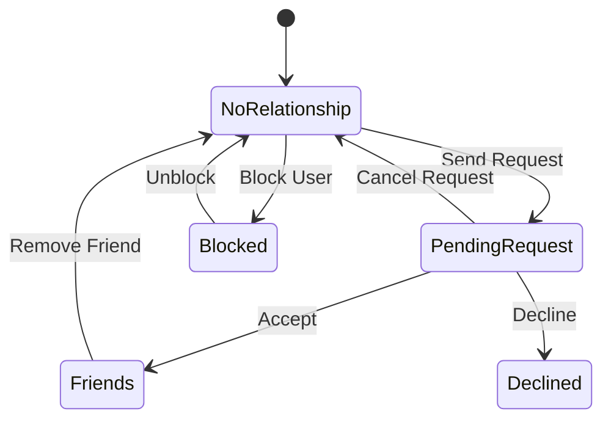

# Log It — Social Features

> **Last updated:** 2026-03-24

## Philosophy

Social should be **lightweight and additive** — never the blocker. The app's core value is personal logging. Social is the layer that makes it more fun, not a requirement.

**Principles:**
1. The app must be fully useful with zero friends
2. Social features enhance discovery, not gate functionality
3. Privacy is simple and user-controlled
4. Social complexity grows gradually across versions

---

## Privacy Model

### Per-Log Privacy

Every log entry has a privacy setting:

| Level | Icon | Who Sees It |
|---|---|---|
| **Public** | 🌍 | Everyone on the platform |
| **Friends** | 👥 | Only accepted friends |
| **Private** | 🔒 | Only the log owner |

### Default Privacy

- Users choose a **default privacy level** during onboarding or in settings
- Each log can override the default
- Default options: `public`, `friends`, `private`

### Privacy Rules

| Scenario | Behavior |
|---|---|
| Viewing someone's profile | See only their `public` logs |
| Viewing a friend's profile | See `public` + `friends` logs |
| "Everyone" feed tab | Only `public` logs |
| "Friends" feed tab | Friends' `public` + `friends` logs |
| "You" feed tab | All your logs regardless of privacy |
| Event detail "Also attended" | Only users with `public` or `friends` (if friends) logs |

---

## MVP Social (v1.0)

Minimal social layer — just enough to make the feed useful.

### What's Included
- [x] Per-log privacy selector (public / friends / private)
- [x] Default privacy in settings
- [x] "Everyone" feed showing public logs
- [x] "You" feed showing own logs
- [ ] Basic user profiles (public view)

### What's NOT Included Yet
- ❌ Friend requests
- ❌ "Friends" feed tab (visible but prompts "coming soon" or "add friends")
- ❌ Shared attendance detection
- ❌ Comments or reactions

---

## v1.5 Social — Friend System

### Friend Request Flow

### Features
- [ ] User search (by username, display name)
- [ ] Send friend request
- [ ] Accept / decline / cancel requests
- [ ] Friends list with count
- [ ] Remove friend
- [ ] Block user (hides all content bidirectionally)
- [ ] "Friends" feed tab goes live
- [ ] Friend count on profile
- [ ] Notification badges for pending requests

### Discovery Mechanisms
- [ ] Search by username
- [ ] Share profile link / QR code
- [ ] "People you may know" (stretch — based on event overlap)

---

## v2.0 Social — Depth

### Shared Attendance

The killer social feature — "you were both at this game."

**Detection:**
- When two friends have logged the same `event_id`, surface it
- Show on event detail page: "Also attended: @mike, @sarah"
- Optional notification: "You and @mike both attended Lakers vs Celtics!"

**Stats:**
- Mutual attendance count between friends
- "You've been to 5 games with @mike"

### Comments & Reactions

| Feature | Details |
|---|---|
| **Comments** | Text comments on any public/friends-visible log |
| **Reactions** | Emoji reactions: 🔥 🏀 👏 ❤️ (tap to add, tap to remove) |
| **Notifications** | Push + in-app for comments/reactions on your logs |
| **Moderation** | Report/block capabilities |

### Social Notifications

| Event | Channel | Priority |
|---|---|---|
| Friend request received | Push + In-app | High |
| Friend request accepted | In-app | Medium |
| Comment on your log | Push + In-app | Medium |
| Reaction on your log | In-app only | Low |
| Shared attendance detected | Push + In-app | Medium |
| Friend logged a game you were at | In-app | Low |

---

## Future Social Ideas (v2.0+)

| Idea | Description | Effort |
|---|---|---|
| **Groups** | Friend groups for group chats / shared logs | High |
| **Leaderboards** | Most games attended among friends | Medium |
| **Event meetups** | "Who's going to tonight's game?" | Medium |
| **Share to social** | Export log as story image for Instagram/X | Low |
| **Activity digest** | Weekly email: "Your friends attended 12 games this week" | Medium |
| **Profile badges** | Verified fan, milestone badges | Low |

---

## Anti-Patterns to Avoid

1. **Don't require friends to use the app** — solo logging must always be the core
2. **Don't spam notifications** — respect user attention
3. **Don't make privacy confusing** — 3 levels is enough, keep it simple
4. **Don't build a full social network** — this is a logbook with social discovery, not Instagram
5. **Don't show follower counts prominently** — this isn't about clout
