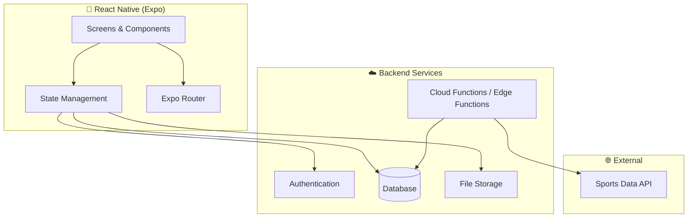

# Log It — Tech Stack & Architecture

> **Last updated:** 2026-03-24

## Platform

| Layer | Choice | Rationale |
|---|---|---|
| **Client** | React Native (Expo) | Cross-platform mobile-first, fast iteration, OTA updates |
| **Navigation** | Expo Router | File-based routing, deep linking support |
| **Backend** | Firebase / Supabase | Auth, DB, storage, real-time — minimal backend code |
| **Database** | Firestore _or_ Supabase Postgres | See decision below |
| **Auth** | Firebase Auth _or_ Supabase Auth | Email, Google, Apple sign-in |
| **Storage** | Firebase Storage / Supabase Storage | User photos, avatars |
| **Sports Data API** | ESPN API / SportsData.io / Ball Don't Lie | Canonical game data ingestion |
| **State Management** | Zustand or React Context | Lightweight, no boilerplate |
| **Styling** | NativeWind (Tailwind for RN) _or_ StyleSheet | TBD based on preference |

> **Decision needed:** Firebase vs. Supabase — see trade-offs below.

---

## Architecture Overview



---

## Firebase vs. Supabase

| Factor | Firebase (Firestore) | Supabase (Postgres) |
|---|---|---|
| **Data model fit** | Document-based — flexible but denormalized | Relational — natural fit for events ↔ logs |
| **Querying** | Limited compound queries, no JOINs | Full SQL, JOINs, complex filters |
| **Real-time** | Excellent built-in | Good, via subscriptions |
| **Auth** | Mature, Google/Apple built-in | Good, supports same providers |
| **Pricing** | Free tier generous, pay-per-read | Free tier generous, predictable |
| **Ecosystem** | Huge community, more RN libraries | Growing fast, great docs |
| **Recommendation** | ✅ Good for speed to MVP | ✅ Better long-term for relational data |

> **Leaning:** Supabase may be the better fit given the relational nature of events, logs, and friendships. Firebase is fine if speed-to-MVP is the top priority.

---

## Sports Data Ingestion

### Strategy

1. **Source:** Use a free/affordable sports API for game schedules and results
2. **Ingestion:** Cloud function runs on a schedule (daily or per-game-day)
3. **Storage:** Canonical `Event` records in the database
4. **Matching:** `external_id` + `external_source` fields prevent duplicates
5. **Updates:** Score and status updates run post-game

### API Candidates

| API | Sports | Free Tier | Notes |
|---|---|---|---|
| **ESPN (unofficial)** | All major | Free (no key) | Undocumented, could change |
| **Ball Don't Lie** | NBA | Free | Clean, well-documented |
| **SportsData.io** | All major | Free trial | Paid for production |
| **The Sports DB** | All major | Free (limited) | Community-maintained |

> **Recommendation:** Start with Ball Don't Lie (NBA) for MVP if basketball is the first sport. Supplement with ESPN unofficial API for broader coverage.

---

## Project Structure (Planned)

```
LogIt/
├── app/                    # Expo Router screens
│   ├── (tabs)/             # Tab-based navigation
│   │   ├── feed.tsx
│   │   ├── logbook.tsx
│   │   └── profile.tsx
│   ├── event/[id].tsx      # Event detail
│   ├── log/new.tsx         # Log creation
│   └── _layout.tsx
├── components/             # Reusable UI components
├── lib/                    # Utilities, API clients, helpers
├── hooks/                  # Custom React hooks
├── store/                  # State management
├── types/                  # TypeScript type definitions
├── constants/              # Colors, config, enums
├── assets/                 # Images, fonts
├── functions/              # Cloud/edge functions (data ingestion)
└── docs/                   # This documentation
```

---

## Development Tooling

| Tool | Purpose |
|---|---|
| **TypeScript** | Type safety across the app |
| **ESLint + Prettier** | Code quality and formatting |
| **Expo EAS** | Builds, updates, submissions |
| **Git + GitHub** | Version control |
| **Figma** (optional) | Design mockups |
