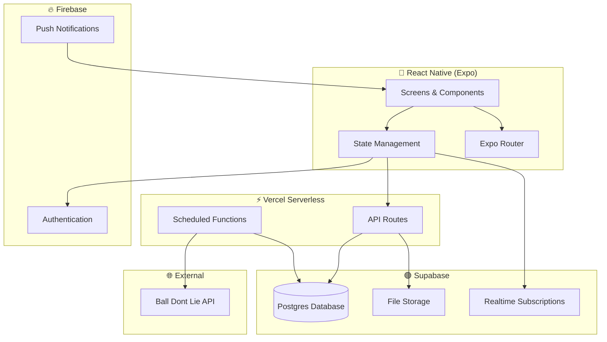

# Log It — Tech Stack & Architecture

> **Last updated:** 2026-03-26

## Platform

| Layer | Choice | Rationale |
|---|---|---|
| **Client** | React Native (iOS-first, Android later) | Cross-platform mobile-first, fast iteration |
| **Navigation** | Expo Router | File-based routing, deep linking support |
| **Backend / API** | Vercel (serverless functions) | Integrates cleanly with serverless API layer |
| **Auth** | Firebase Authentication | Familiar, mature, Google/Apple built-in |
| **Database** | Supabase (Postgres) | Relational — natural fit for events, logs, friendships |
| **Storage** | Supabase Storage | User photos, avatars |
| **Sports Data API** | Ball Don't Lie (NBA first) | Free, well-documented, clean NBA data |
| **State Management** | Zustand or React Context | Lightweight, no boilerplate |
| **Language** | TypeScript | Type safety across the app |

### Rationale

- **Postgres** fits relational data (events, logs, friendships, stats) naturally
- **Supabase** provides a free tier and built-in dashboard (acts as initial admin panel)
- **Firebase Auth** keeps existing familiarity and fast setup
- **Vercel** integrates cleanly with a serverless API layer

### Initial Cost Target

**$0/month** on free tiers during MVP and early usage.

---

## Architecture Overview



---

## Sports Data Ingestion

### Strategy

1. **Source:** Ball Don't Lie API for NBA game schedules and results
2. **Ingestion:** Vercel cron function runs on a schedule (daily or per-game-day)
3. **Storage:** Canonical `Event` records in Supabase Postgres
4. **Matching:** `external_id` + `external_source` fields prevent duplicates
5. **Updates:** Score and status updates run post-game

### API Candidates

| API | Sports | Free Tier | Notes |
|---|---|---|---|
| **Ball Don't Lie** | NBA | ✅ Free | Clean, well-documented — **MVP choice** |
| **ESPN (unofficial)** | All major | Free (no key) | Undocumented, could change |
| **SportsData.io** | All major | Free trial | Paid for production |
| **The Sports DB** | All major | Free (limited) | Community-maintained |

> **Decision:** Start with Ball Don't Lie for NBA. Evaluate broader APIs when adding MLB/NFL/NHL.

---

## Admin & Internal Tools

| Phase | Approach |
|---|---|
| **MVP** | Supabase dashboard — inspect users, logs, events, photos |
| **Later** | Custom admin portal (Next.js on Vercel) or tools like Retool/Appsmith |

---

## Project Structure (Planned)

```
LogIt/
├── app/                    # Expo Router screens
│   ├── (tabs)/             # Tab-based navigation
│   │   ├── feed.tsx
│   │   ├── logbook.tsx
│   │   └── profile.tsx
│   ├── event/[id].tsx      # Event detail
│   ├── log/new.tsx         # Log creation
│   └── _layout.tsx
├── components/             # Reusable UI components
├── lib/                    # Utilities, API clients, helpers
├── hooks/                  # Custom React hooks
├── store/                  # State management
├── types/                  # TypeScript type definitions
├── constants/              # Colors, config, enums
├── assets/                 # Images, fonts
├── api/                    # Vercel serverless functions
│   ├── events/
│   ├── logs/
│   ├── feed/
│   ├── friends/
│   └── cron/               # Scheduled data ingestion
└── docs/                   # This documentation
```

---

## Development Tooling

| Tool | Purpose |
|---|---|
| **TypeScript** | Type safety across the app |
| **ESLint + Prettier** | Code quality and formatting |
| **Expo EAS** | Builds, updates, submissions |
| **Git + GitHub** | Version control |
| **Vercel** | API hosting + cron jobs |
| **Figma** (optional) | Design mockups |
