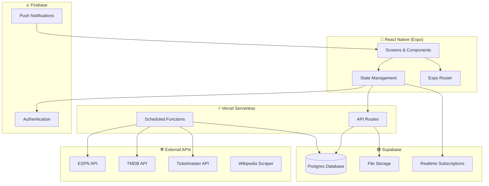

# Log It — Tech Stack & Architecture

> **Last updated:** 2026-03-29
> **Changes:**
> - 2026-03-29: Updated project structure to reflect actual repo (added `server-lib/`, `scripts/`, `api/` subdirectories). Removed stale Ball Don't Lie decision note.
> - 2026-03-29: Replaced Ball Dont Lie with ESPN API for primary sports ingestion and media. Added Wikipedia scraper strategy for NBA generic venue imagery.
> - 2026-03-28: Added cron job architecture (daily NBA sync), NBA venue static mapping, backfill endpoint. Cross-ref `EXTERNAL_SERVICES.md` for full ingestion strategy per event type.
> - 2026-03-26: Updated project structure to match Phase 1 implementation (auth/onboarding groups, API layer, store, actual dependencies)

## Platform

| Layer | Choice | Rationale |
|---|---|---|
| **Client** | React Native (iOS-first, Android later) | Cross-platform mobile-first, fast iteration |
| **Navigation** | Expo Router | File-based routing, deep linking support |
| **Backend / API** | Vercel (serverless functions) | Integrates cleanly with serverless API layer |
| **Auth** | Firebase Authentication | Familiar, mature, Google/Apple built-in |
| **Database** | Supabase (Postgres) | Relational — natural fit for events, logs, friendships |
| **Storage** | Supabase Storage | User photos, avatars, sports team logos |
| **Event Data (Sports)** | ESPN API | Free, unauthenticated, reliable box scores and schedules |
| **Event Data (Movies)** | TMDB | Free API key, movie posters + metadata |
| **Event Data (Concerts)** | Ticketmaster Discovery API | Free, millions of events, artist data |
| **Event Media (Sports)** | ESPN API / Wikipedia | High-res EPSN team logos + Wikipedia scraped arena photos |
| **Event Media (Artists)** | Muzooka | Artist photos, free tier |
| **State Management** | Zustand or React Context | Lightweight, no boilerplate |
| **Language** | TypeScript | Type safety across the app |

### Rationale

- **Postgres** fits relational data (events, logs, friendships, stats) naturally
- **Supabase** provides a free tier and built-in dashboard (acts as initial admin panel)
- **Firebase Auth** keeps existing familiarity and fast setup
- **Vercel** integrates cleanly with a serverless API layer

### Initial Cost Target

**$0/month** on free tiers during MVP and early usage.

---

## Architecture Overview



---

## Event Data Ingestion

### Strategy

1. **Source:** External APIs for each event type (starting with ESPN API for NBA)
2. **Ingestion:** Vercel cron functions run on a schedule (daily or per-event-day)
3. **Storage:** Canonical `Event` records in Supabase Postgres (base table + type-specific child tables)
4. **Matching:** `external_id` + `external_source` fields prevent duplicates
5. **Updates:** Status and score/result updates run post-event

### Data APIs by Event Type

| Event Type | API | Free Tier | What It Provides |
|---|---|---|---|
| **Sports (NBA)** | ESPN API | ✅ Free | NBA schedules, scores, teams, high-res logos — **MVP choice** |
| **Sports (all)** | TheSportsDB | ✅ Free JSON API | Schedules, results, team data for NBA/MLB/NFL/NHL |
| **Sports (all)** | API-Sports | 100 req/day free | Comprehensive sports data; logo calls are free |
| **Movies** | TMDB | ✅ Free API key | Movie metadata, posters, cast, genres, ratings |
| **Concerts** | Ticketmaster Discovery | ✅ Free | Millions of events, artist data, venues, tour dates |
| **Concerts** | Setlist.fm | ✅ Free (non-commercial) | Setlists, artist history, venue data |
| **Restaurants** | Google Places | $200/mo free credits | Restaurant data, reviews, photos |
| **Restaurants** | Foursquare | 10k free calls | Venue data, categories, tips |

### Media / Image APIs

| Category | API | Strategy |
|---|---|---|
| **Sports team logos** | ESPN API | Fetched directly dynamically (no storage costs) |
| **Sports venues** | Wikipedia Images | Local static mapping holding Wikipedia CDN links |
| **Movie posters** | TMDB | Fetch on-demand via `https://image.tmdb.org/t/p/w500/{path}` |
| **Artist/concert photos** | Muzooka, Ticketmaster | Fetch on-demand |
| **Restaurant photos** | Google Places, Foursquare | Fetch on-demand |
| **Fallback/generic images** | Unsplash API (50 req/hr free) | Default event imagery |

> **Decision:** Start with ESPN API for NBA (free, unauthenticated). Team logos are fetched dynamically from ESPN CDN (no storage costs). Movie and concert API integrations come when those event types launch.

---

## Admin & Internal Tools

| Phase | Approach |
|---|---|
| **MVP** | Supabase dashboard — inspect users, logs, events, photos |
| **Later** | Custom admin portal (Next.js on Vercel) or tools like Retool/Appsmith |

---

## Project Structure (Planned)

```
LogIt/
├── app/                    # Expo Router screens
│   ├── (auth)/             # Auth group (welcome, sign-in, sign-up)
│   ├── (onboarding)/       # Post-auth (profile-setup, preferences, done)
│   ├── (tabs)/             # Tab-based navigation
│   │   ├── _layout.tsx     # Tab navigator config
│   │   ├── feed.tsx
│   │   ├── logbook.tsx
│   │   ├── add-log.tsx
│   │   ├── search.tsx
│   │   └── profile.tsx
│   ├── index.tsx           # Entry redirect (auth-aware)
│   └── _layout.tsx         # Root layout with auth gate
├── api/                    # Vercel serverless functions
│   ├── auth/               # Auth endpoints (signup, me)
│   ├── cron/               # Scheduled jobs (sync-nba, backfill-nba)
│   ├── events/             # Event endpoints (search, box-score)
│   ├── logs/               # Log endpoints (create, update, delete, mine)
│   └── users/              # User endpoints (profile, username check)
├── server-lib/             # Server-side utilities (Supabase admin, auth, NBA venues)
├── scripts/                # One-off scripts (ESPN backfill, arena images)
├── components/             # Reusable UI components
│   └── ui/                 # EditLogModal, EventDetailModal, GlassCard, etc.
├── constants/              # Colors, typography, config, enums, theme
├── hooks/                  # Custom React hooks
├── lib/                    # Client-side utilities (Supabase, Firebase, API client)
├── store/                  # Zustand state management (authStore)
├── types/                  # TypeScript type definitions (event, log, user, api)
├── assets/                 # Images, fonts
├── supabase/               # Database migrations
│   └── migrations/         # 001-009 (users, events, sports, logs, venues, search)
└── docs/                   # Planning documentation
```

---

## Development Tooling

| Tool | Purpose |
|---|---|
| **TypeScript** | Type safety across the app |
| **ESLint + Prettier** | Code quality and formatting |
| **Expo EAS** | Builds, updates, submissions |
| **Git + GitHub** | Version control |
| **Vercel** | API hosting + cron jobs |
| **Figma** (optional) | Design mockups |
