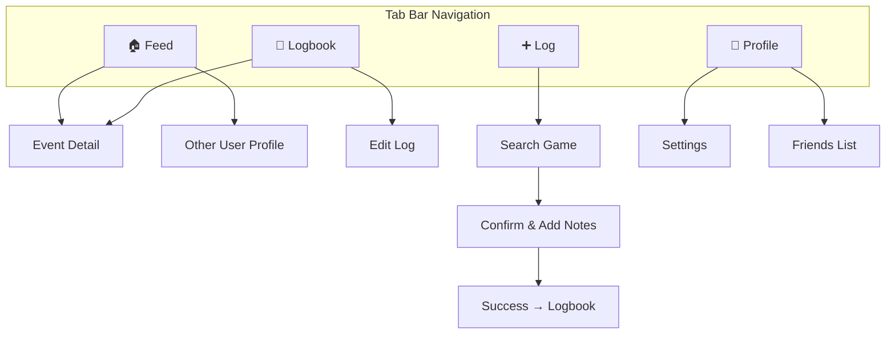
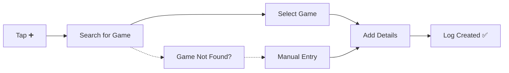
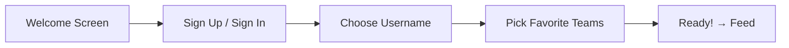

# Log It — UI Design & User Flows

> **Last updated:** 2026-03-24

## Navigation Structure



---

## Screen Inventory

### Tab Screens

| Screen | Tab | Purpose |
|---|---|---|
| **Feed** | 🏠 | Default screen — scrollable feed of logged events |
| **Logbook** | 📖 | Personal archive — all your logs with filters |
| **Add Log** | ➕ | Entry point for logging a new event |
| **Profile** | 👤 | Your profile, stats summary, settings |

### Detail / Modal Screens

| Screen | Access From | Purpose |
|---|---|---|
| **Event Detail** | Feed, Logbook | Rich game info — score, teams, venue, attendees |
| **Search Game** | Add Log | Find a game from the database |
| **Confirm Log** | Search Game | Add notes, set privacy, confirm |
| **Edit Log** | Logbook, Event Detail | Modify notes/privacy on an existing log |
| **Other User Profile** | Feed | View another user's public logs |
| **Settings** | Profile | Account, privacy defaults, notifications |
| **Friends List** | Profile | Manage friends |
| **Onboarding** | First launch | Account creation + team selection |

---

## Screen Details

### 1. Feed

The default screen when opening the app.

**Layout:**
- Tab selector at top: `Everyone` · `You` · `Friends`
- Scrollable list of log cards
- Each card shows: user avatar, name, event title, teams, date, venue
- Tapping a card → Event Detail

**Behavior:**
- If no friends → `Friends` tab prompts add-friend flow
- Privacy controls filter what appears (public logs only in `Everyone`)
- Pull-to-refresh

**Empty States:**
- First time: "Welcome! Log your first game →"
- No friends: "Add friends to see their activity"

---

### 2. Logbook

The power-user screen — your complete history.

**Layout:**
- Header with total count: "47 events logged"
- Filter bar (collapsible or sheet):
  - Sport (Basketball, Baseball, etc.)
  - Team (searchable dropdown)
  - Date range (preset: This year, Last year, All time, Custom)
  - Venue
  - Privacy (Public / Friends / Private)
- Scrollable list of log entries, sorted newest first
- Each entry: event title, date, venue, privacy badge

**Design Direction:**
- Unified single list — filter down, don't force category navigation
- Quick toggles for most common filters
- Active filters shown as removable chips

---

### 3. Add Log (Event Logging Flow)

**Step-by-step flow:**



**Step 1 — Search for Game:**
- Search bar with auto-suggest
- Filter by sport, team, date
- Results show: Teams vs Teams · Date · Venue
- "Can't find your game?" → manual entry fallback

**Step 2 — Select Game:**
- Tapping a result shows a preview card with game details
- "Log This Game" button

**Step 3 — Add Details:**
- Notes field (optional, multiline)
- Privacy selector: 🌍 Public · 👥 Friends · 🔒 Private
- Rating (optional, 1-5 stars)
- Photos (optional, future)
- "Log It" confirmation button

**Step 4 — Success:**
- Confirmation animation
- "View in Logbook" or "Log Another" actions

---

### 4. Event Detail Page

The rich view of a single game.

**Layout:**
```
┌─────────────────────────────┐
│  🏀  Lakers vs Celtics      │
│  Final: 112 - 108           │
│                             │
│  📅  March 15, 2026         │
│  📍  Crypto.com Arena, LA   │
│                             │
│  ────────────────────────── │
│                             │
│  ✅ You attended            │
│  📝 "Incredible game,      │
│      went to OT!"          │
│  ⭐ ⭐ ⭐ ⭐ ⭐               │
│                             │
│  ────────────────────────── │
│                             │
│  👥 Also attended (3)       │
│  @mike  @sarah  @alex      │
│                             │
└─────────────────────────────┘
```

**Sections:**
1. **Game header** — Teams, score, status
2. **Game info** — Date, time, venue with map link
3. **Your log** — Attendance badge, notes, rating
4. **Social** (future) — Who else attended, comments

---

### 5. Profile

**Layout:**
- Avatar, display name, username
- Bio
- Quick stats row: `47 games` · `12 venues` · `8 teams`
- Recent logs (last 3-5)
- Links to: Settings, Friends, Full Logbook

---

### 6. Onboarding Flow



**Screens:**
1. **Welcome** — App name, tagline, illustration, "Get Started"
2. **Auth** — Email, Google, Apple sign-in options
3. **Username** — Choose unique handle
4. **Favorite Teams** — Grid of team logos, multi-select, skippable
5. **Done** — "You're all set!" → navigate to Feed

---

## Design System Notes

### Colors (Direction)
- Dark mode primary (feels premium, sports-broadcast energy)
- Accent color: vibrant (electric blue or energetic orange)
- Card backgrounds: elevated surface color
- Team colors used contextually on event cards

### Typography
- Clean sans-serif (Inter, SF Pro, or similar)
- Large bold headers
- Readable body text for notes

### Component Patterns
- **Cards** — Primary UI pattern for logs and events
- **Chips** — For filters, tags, team badges
- **Bottom Sheet** — For filter panels, quick actions
- **Floating Action** — The ➕ log button
- **Skeleton Loading** — For feed and logbook

### Animations
- Card press/expand
- Log creation celebration (confetti or checkmark)
- Tab transitions
- Pull-to-refresh with custom animation
