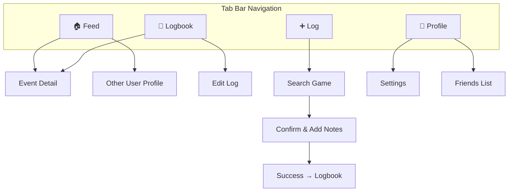
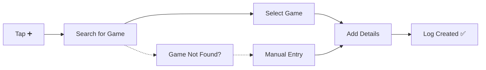
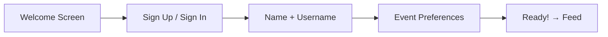

# Log It — UI Design & User Flows

> **Last updated:** 2026-03-26
> Updated: Polymorphic event types, companions, comments, event-type-agnostic filters

## Navigation Structure



---

## Screen Inventory

### Tab Screens

| Screen | Tab | Purpose |
|---|---|---|
| **Feed** | 🏠 | Default screen — scrollable feed of logged events |
| **Logbook** | 📖 | Personal archive — all your logs with filters |
| **Add Log** | ➕ | Entry point for logging a new event |
| **Profile** | 👤 | Your profile, stats summary, settings |

### Detail / Modal Screens

| Screen | Access From | Purpose |
|---|---|---|
| **Event Detail** | Feed, Logbook | Rich game info — score, teams, venue, attendees |
| **Search Game** | Add Log | Find a game from the database |
| **Confirm Log** | Search Game | Add notes, set privacy, confirm |
| **Edit Log** | Logbook, Event Detail | Modify notes/privacy on an existing log |
| **Other User Profile** | Feed | View another user's public logs |
| **Settings** | Profile | Account, privacy defaults, notifications |
| **Friends List** | Profile | Manage friends |
| **Notifications** | Bell icon / Profile | Reminders, post-event prompts, friend activity |
| **Onboarding** | First launch | Account creation + team selection |

---

## Screen Details

### 1. Feed

The default screen when opening the app.

**Layout:**
- Tab selector at top: `Everyone` · `You` · `Friends`
- Scrollable list of log cards
- Each card shows: user avatar, name, event title, teams, date, venue
- Tapping a card → Event Detail

**Behavior:**
- `Friends` tab stays visible even when empty — prompts invite/add-friend flows to drive growth
- Privacy controls filter what appears (public logs only in `Everyone`)
- Pull-to-refresh

**Empty States:**
- First time: "Welcome! Log your first game →"
- No friends: Growth-focused prompt — invite friends, tease overlap insights, early adopter badges

---

### 2. Logbook

The power-user screen — your complete history.

**Layout:**
- Header with total count: "47 events logged"
- Filter bar (collapsible or sheet):
  - Event Type (Sports, Movies, Concerts, Restaurants, Manual)
  - Type-specific filters (Team, League, Artist, Genre, Cuisine — shown when type selected)
  - Date range (preset: This year, Last year, All time, Custom)
  - Venue
  - Privacy (Public / Friends / Private)
  - Rating (minimum star filter)
- Scrollable list of log entries, sorted newest first
- Each entry: event title, date, venue, privacy badge, companion count

**Design Direction:**
- Unified single list — filter down, don't force category navigation
- Quick toggles for most common filters
- Active filters shown as removable chips
- Full-text search across event titles and venues

---

### 3. Add Log (Event Logging Flow)

**Step-by-step flow:**



**Step 1 — Search for Game:**
- Search bar with auto-suggest
- Filter by sport, team, date
- Results show: Teams vs Teams · Date · Venue
- "Can't find your game?" → manual entry fallback

**Step 2 — Select Game:**
- Tapping a result shows a preview card with game details
- "Log This Game" button

**Step 3 — Add Details:**
- Notes field (optional, multiline)
- Privacy selector: 🌍 Public · 👥 Friends · 🔒 Private
- Rating (optional, 1-5 stars)
- Photos (optional, up to a few per log — stored in Supabase Storage)
- Companions — "Who'd you go with?" section:
  - Search friends to tag (linked via `user_id`)
  - Or type a freeform name (e.g., "My dad")
  - Multiple companions supported
- "Log It" confirmation button

**Step 4 — Success:**
- Confirmation animation
- "View in Logbook" or "Log Another" actions

---

### 4. Event Detail Page

The rich view of a single game.

**Layout:**
```
┌─────────────────────────────┐
│  🏀  Lakers vs Celtics      │
│  Final: 112 - 108           │
│                             │
│  📅  March 15, 2026         │
│  📍  Crypto.com Arena, LA   │
│                             │
│  ────────────────────────── │
│                             │
│  ✅ You attended            │
│  📝 "Incredible game,      │
│      went to OT!"          │
│  ⭐ ⭐ ⭐ ⭐ ⭐               │
│                             │
│  ────────────────────────── │
│                             │
│  👥 Also attended (3)       │
│  @mike  @sarah  @alex      │
│                             │
└─────────────────────────────┘
```

**Sections:**
1. **Game header** — Teams, score, status
2. **Game info** — Date, time, venue with map link
3. **Your log** — Attendance badge, notes, rating, photos
4. **Social** (future) — Who else attended, comments

---

### 5. Profile

**Layout:**
- Avatar, display name, username
- Bio
- Quick stats row: `47 games` · `12 venues` · `8 teams`
- Recent logs (last 3-5)
- Links to: Settings, Friends, Full Logbook

---

### 6. Onboarding Flow



**Screens:**
1. **Welcome** — App name, tagline, illustration, "Get Started"
2. **Auth** — Email, Google, Apple sign-in options
3. **Name + Username** — First name, last name, choose unique handle
4. **Event Preferences** — Choose which event types you'll use (sports, movies, concerts, restaurants). Lightweight, skippable. _Not_ picking specific teams/artists — that's future._
5. **Done** — "You're all set!" → navigate to Feed

---

## Design System Notes

### UI Reference Mockups

Interactive HTML mockups live in [`docs/ui-reference/`](./ui-reference/). Open in a browser to preview. These are **inspiration/direction**, not strict specs.

| Mockup | Screen | Key Patterns |
|---|---|---|
| [add-log.html](./ui-reference/add-log.html) | Add Log | Glass cards, gradient search glow, game select, notes/privacy form, "Save Log" CTA |
| [profile.html](./ui-reference/profile.html) | Profile | Avatar with gradient ring, bento stats grid, milestones/badges, map visualization |
| [event-detail.html](./ui-reference/event-detail.html) | Event Detail | Scoreboard hero with atmospheric blur, metadata grid, action buttons, friends avatars |
| [logbook.html](./ui-reference/logbook.html) | Logbook | Filter chips, sorted cards with win/loss/draw color-coded borders, FAB |

### Color Palette (from mockups)

| Token | Hex | Usage |
|---|---|---|
| `background` | `#0a0e14` | App background |
| `surface-container-high` | `#1b2028` | Card backgrounds |
| `surface-container-lowest` | `#000000` | Input fields, deep surfaces |
| `primary` | `#aaffdc` | Text accents, highlights |
| `primary-container` / `primary-fixed` | `#00fdc1` | CTA buttons, badges |
| `secondary` | `#679cff` | Secondary accents, links |
| `tertiary` | `#ac89ff` | Stats, win ratio, badges |
| `error` | `#ff716c` | Loss indicators |
| `on-surface` | `#f1f3fc` | Primary text |
| `on-surface-variant` | `#a8abb3` | Secondary text |
| Brand glow | `#00FFC2` | Logo, nav highlights, glows |

### Typography
- **Headlines**: Manrope (extrabold, tight tracking)
- **Body/Labels**: Inter (400–600 weight)
- Large bold headers with uppercase tracking for labels
- `10px` uppercase tracking for metadata labels

### Visual Techniques
- **Glassmorphism**: `backdrop-blur-xl` + semi-transparent backgrounds
- **Atmospheric glow**: Large blurred circles (`blur-[100px]`) in primary/secondary behind hero sections
- **Gradient CTAs**: `linear-gradient(135deg, #aaffdc, #00fdc1)` with box-shadow glow
- **Border-left color coding**: Green (win), Blue (draw), Red (loss) on logbook cards
- **Neon glow**: `drop-shadow` and `box-shadow` with primary color on brand elements

### Icons
- **Google Material Symbols Outlined** (variable weight/fill)
- Filled variant (`FILL 1`) for active states and CTAs
- Sport-specific icons: `sports_basketball`, `sports_soccer`, etc.

### Component Patterns
- **Cards** — Primary UI pattern for logs and events
- **Glass Cards** — Semi-transparent with backdrop blur for selected/featured items
- **Chips** — Rounded-full filter buttons with icons
- **Bottom Sheet** — For filter panels, quick actions
- **Bottom Nav** — Rounded top corners, backdrop blur, glow on active item
- **Floating Action Button** — Gradient primary, visible on mobile only
- **Skeleton Loading** — For feed and logbook
- **Avatar stacks** — Overlapping `-space-x-4` with border rings

### Animations
- Card press/expand (`active:scale-[0.98]`)
- Hover scale (`hover:scale-[1.02]`) on stat cards
- Log creation celebration (confetti or checkmark)
- Tab transitions
- Pull-to-refresh with custom animation
- Opacity reveal on hover (chevron arrows on logbook cards)

