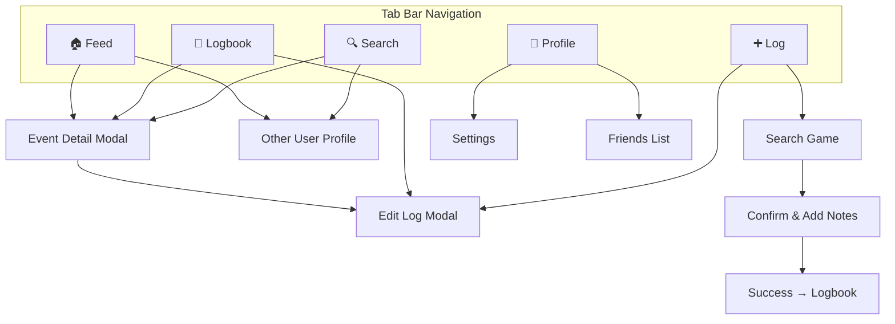
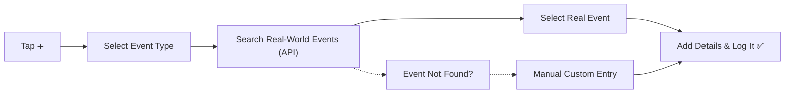
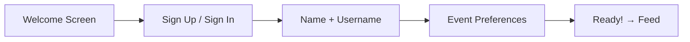

# Log It — UI Design & User Flows

> **Last updated:** 2026-04-01
> **Changes:**
> - 2026-04-02: Added season type badges (PRE/R1/R2/R3/FIN) to logbook and add-log cards. Reordered logbook metadata row: league → stars → privacy → companions (left), season badge + W/L (right-aligned).
> - 2026-04-01: EditLogModal overhauled — polymorphic top sections (team logos/scores for sports, hero title for others), venue background image, reordered bottom (Rating+Privacy → Notes → Photos → Type-specific → Companions → Actions). Photos now work during creation. Edit→Detail return flow: saving edits reopens EventDetailModal with updated data.
> - 2026-03-31: Redesigned team browse: season-grouped inline headers ("2025-26", "2024-25"), phase sub-dividers (preseason/postseason), client-side filter bar, 100-result initial load with deduped Load More. Documented success checkmark animation.
> - 2026-03-29: Documented sports browse flow (Sports Hub -> Teams grid -> pre-filled search) in Add Log. Updated search to note pagination/load more and multi-word token search.
> - 2026-03-29: Fixed stale Ball Don't Lie reference in Add Log search to ESPN.

> - 2026-03-29: Fully documented the implementation of Logbook's dynamic timeline layout, including Upcoming vs Past grouping, monthly dividers, and days-remaining pills.
> - 2026-03-28: Added Search/Explore tab for discovering events logged by other users. Added Edit/Create Log Modal with type-specific input sections for all 6 event types. Updated navigation graph with search and edit log flows.

## Navigation Structure



---

## Screen Inventory

### Tab Screens

| Screen | Tab | Purpose |
|---|---|---|
| **Feed** | 🏠 | Default screen — scrollable feed of logged events |
| **Logbook** | 📖 | Personal archive — all your logs with filters |
| **Add Log** | ➕ | Entry point for logging a new event |
| **Search** | 🔍 | Discover events, venues, and other users' logs |
| **Profile** | 👤 | Your profile, stats summary, settings |

### Detail / Modal Screens

| Screen | Access From | Purpose |
|---|---|---|
| **Event Detail Modal** | Feed, Logbook | Rich event info — score, teams, venue, attendees |
| **Edit/Create Log Modal** | Add Log, Event Detail | Create new or edit existing log with type-specific inputs |
| **Search Game** | Add Log | Find a game from the database |
| **Confirm Log** | Search Game | Add notes, set privacy, confirm |
| **Other User Profile** | Feed | View another user's public logs |
| **Settings** | Profile | Account, privacy defaults, notifications |
| **Friends List** | Profile | Manage friends |
| **Notifications** | Bell icon / Profile | Reminders, post-event prompts, friend activity |
| **Onboarding** | First launch | Account creation + team selection |

---

## Screen Details

### 1. Feed

The default screen when opening the app.

**Layout:**
- Tab selector at top: `Everyone` · `You` · `Friends`
- Scrollable list of log cards
- Each card shows: user avatar, name, event title, teams, date, venue
- Tapping a card → Event Detail

**Behavior:**
- `Friends` tab stays visible even when empty — prompts invite/add-friend flows to drive growth
- Privacy controls filter what appears (public logs only in `Everyone`)
- Pull-to-refresh

**Empty States:**
- First time: "Welcome! Log your first game →"
- No friends: Growth-focused prompt — invite friends, tease overlap insights, early adopter badges

---

### 2. Logbook

The power-user screen — your complete history.

**Layout:**
- Header with total count: "47 events logged"
- Filter bar (collapsible or sheet) with quick toggles for Event Type, Date Range, Privacy, etc.
- **Dynamic Timeline View:**
  - **Upcoming Events:** Stacked at the top with a dynamic days-remaining pill (`IN 5 DAYS`, `TODAY`). Auto-hides if empty.
  - **Past Events:** Grouped chronologically with sleek `MONTH YEAR` text dividers.
- Each entry: event title, date, venue
- **Bottom metadata row (left→right):** league tag, star rating, privacy icon, companion count — then right-aligned: **season badge** (PRE/R1/R2/R3/FIN with game number) + W/L result
- Season badges only appear for non-regular-season games (preseason=green, playoffs=orange, finals=gold)

**Design Direction:**
- Unified single list — filter down, don't force category navigation
- Quick toggles for most common filters
- Active filters shown as removable chips
- Full-text search across event titles and venues

---

### 3. Add Log (Event Logging Flow)

**Step-by-step flow:**



**Step 1 — Choose Type:**
- Users select the event type (Sports, Movies, Concerts, Nightlife, etc.)

**Step 1a — Sports Browse Flow (Sports only):**
- Selecting Sports shows a **Sports Hub** with two paths:
  1. **Search All Games** — green full-width button, opens the freeform search screen
  2. **Browse by Sport** — rows for NBA, NFL (active); MLB/NHL (coming soon)
     - Tapping a league shows a **team logo grid** (ESPN logos)
     - Tapping a team:
       - Shows team name header with logo
       - **Client-side filter bar** to narrow results by title
       - Loads 100 results initially, grouped by **season** with inline headers (e.g., "2025-26")
       - **Phase sub-dividers** for preseason (green) and postseason (orange) within seasons
       - **Load More** button with deduplication to prevent duplicate keys
- Back navigation: Games → Teams → Hub → Type grid

**Step 2 — Search/Browse Real Events:**
- Search queries Supabase via `search_events` RPC (fuzzy: trigram + levenshtein, ILIKE on title, teams, venue, round)
- Multi-word queries (e.g. "celtics golden state") are tokenized: longest word sent to DB, secondary tokens post-filtered in API
- Results paginate at 40/page; **Load More** button appears when `has_more: true`
- If search yields no results, "Add Manually" fallback appears

**Step 3 — Select Event & Add Details:**

- Notes field (optional, multiline)
- Privacy selector: 🌍 Public · 👥 Friends · 🔒 Private
- Rating (optional, 1-5 stars)
- Photos (optional, up to a few per log — stored in Supabase Storage)
- Companions — "Who'd you go with?" section:
  - Search friends to tag (linked via `user_id`)
  - Or type a freeform name (e.g., "My dad")
  - Multiple companions supported
- "Log It" confirmation button

**Step 4 — Success:**
- Confirmation animation
- "View in Logbook" or "Log Another" actions

---

### 3a. Edit / Create Log Modal (`EditLogModal`)

Ticket-style modal matching the Event Detail Modal design language, used for both **creating** a new log and **editing** an existing one. Accessed from:
- **Add Log tab** → tap any event card → opens in create mode
- **Event Detail Modal** → tap "Edit Log" → opens in edit mode, pre-filled with existing data

**Top section (above dashed separator):**
- Venue background image with 85% dim + vignette gradients
- "New/Edit [Type]" green badge
- **Polymorphic content per event type:**
  - **Sports:** Team logos (52px) + score bug (46px ExtraBold) — read-only
  - **Movie/Concert/Restaurant/Nightlife:** Hero title + metadata pills (director, artist, genre, etc.)
  - **Custom/manual:** Editable title input
- Compact venue/date MetaGrid (two rounded cells, centered text)
- Entire top section is a drag-to-dismiss hotbox

**Bottom section (scrollable, below separator):**

| Order | Section | Details |
|---|---|---|
| 1 | ⭐ Rating + Privacy | Half-star rating (left) + privacy icon pills (right) on same row |
| 2 | 📝 Notes | Multiline input with icon section header |
| 3 | 📸 Photos | Horizontal scroll with add button, works in both create and edit modes |
| 4 | 🔧 Type-specific | Sports: sport/league/season/teams/scores. Movie: director/genre/runtime/cast/watched-at. Concert: artist/tour/opener/setlist. Restaurant: cuisine/price. Nightlife: venue type/vibe/dress/music/price |
| 5 | 👥 Companions | Text input + chip list with remove |
| 6 | 🔘 Actions | "Log It" / "Save Changes" + Cancel |

**Edit→Detail return flow:** After saving edits from Logbook, the EditLogModal dismisses and the EventDetailModal reopens with merged updated data (350ms animation delay).

**Component:** [EditLogModal.tsx](file:///Users/jonahrothman/Desktop/Workspace/LogIt/components/ui/EditLogModal.tsx)

---

### 3b. Search / Explore (`search.tsx`)

Discover events and browse logs from other users. Positioned to the right of the ➕ button in the tab bar.

**Layout:**
- **Header:** "Explore" title
- **Search bar:** Full-text search across events, venues, and usernames (GlassCard styled)
- **Type filter chips:** Horizontal scrollable row — All, Sports, Movies, Concerts, Dining, Nightlife
- **Recent searches:** Displayed when search bar is empty, tappable to re-search
- **Trending events:** Cards showing popular/recently logged events with:
  - Type icon, title, venue, date
  - Log count badge (👥 number of users who logged it)
  - Average rating (⭐)
- **Browse by Category:** Grid of type cards for quick category exploration
- Tapping any result card → opens EventDetailModal

**Future enhancements:**
- Server-side full-text search via Supabase
- Popularity ranking based on number of logs
- User search + profile discovery
- Location-based nearby events

**Component:** [`search.tsx`](file:///Users/jonahrothman/Desktop/Workspace/LogIt/app/(tabs)/search.tsx)

---

### 4. Event Detail Page

The rich view of a single game.

**Layout:**
```
┌─────────────────────────────┐
│  🏀  Lakers vs Celtics      │
│  Final: 112 - 108           │
│                             │
│  📅  March 15, 2026         │
│  📍  Crypto.com Arena, LA   │
│                             │
│  ────────────────────────── │
│                             │
│  ✅ You attended            │
│  📝 "Incredible game,      │
│      went to OT!"          │
│  ⭐ ⭐ ⭐ ⭐ ⭐               │
│                             │
│  ────────────────────────── │
│                             │
│  👥 Also attended (3)       │
│  @mike  @sarah  @alex      │
│                             │
└─────────────────────────────┘
```

**Sections:**
1. **Game header** — Teams, score, status
2. **Game info** — Date, time, venue with map link
3. **Your log** — Attendance badge, notes, rating, photos
4. **Social** (future) — Who else attended, comments

---

### 5. Profile

**Layout:**
- Avatar, display name, username
- Bio
- Quick stats row: `47 games` · `12 venues` · `8 teams`
- Recent logs (last 3-5)
- Links to: Settings, Friends, Full Logbook

---

### 6. Onboarding Flow



**Screens:**
1. **Welcome** — App name, tagline, illustration, "Get Started"
2. **Auth** — Email, Google, Apple sign-in options
3. **Name + Username** — First name, last name, choose unique handle
4. **Event Preferences** — Choose which event types you'll use (sports, movies, concerts, restaurants). Lightweight, skippable. _Not_ picking specific teams/artists — that's future._
5. **Done** — "You're all set!" → navigate to Feed

---

## Design System Notes

### UI Reference Mockups

Interactive HTML mockups live in [`docs/ui-reference/`](./ui-reference/). Open in a browser to preview. These are **inspiration/direction**, not strict specs.

| Mockup | Screen | Key Patterns |
|---|---|---|
| [add-log.html](./ui-reference/add-log.html) | Add Log | Glass cards, gradient search glow, game select, notes/privacy form, "Save Log" CTA |
| [profile.html](./ui-reference/profile.html) | Profile | Avatar with gradient ring, bento stats grid, milestones/badges, map visualization |
| [event-detail.html](./ui-reference/event-detail.html) | Event Detail | Scoreboard hero with atmospheric blur, metadata grid, action buttons, friends avatars |
| [logbook.html](./ui-reference/logbook.html) | Logbook | Filter chips, sorted cards with win/loss/draw color-coded borders, FAB |

### Color Palette (Spatial Green v2)

| Token | Hex | Usage |
|---|---|---|
| `background` | `#030712` | App background (dark mode) |
| `surface-container-high` | `#1b2028` | Card backgrounds |
| `surface-container-lowest` | `#000000` | Input fields, deep surfaces |
| `glass` | `rgba(20, 25, 30, 0.4)` | Glass panel backgrounds |
| `glass-border` | `rgba(255, 255, 255, 0.1)` | Glass panel borders |
| `primary` | `#aaffdc` | Text accents, highlights |
| `primary-container` / `primary-fixed` | `#00FFC2` | CTA buttons, badges, brand glow |
| `secondary` | `#679cff` | Secondary accents, links |
| `tertiary` | `#ac89ff` | Stats, win ratio, badges |
| `error` | `#ff716c` | Loss indicators |
| `on-surface` | `#f1f3fc` | Primary text |
| `on-surface-variant` | `#9ca3af` | Secondary text |
| Brand glow | `#00FFC2` | Logo, nav highlights, neon glows |

### Typography
- **Headlines**: Manrope (extrabold, tight tracking)
- **Body/Labels**: Inter (400–600 weight)
- Large bold headers with uppercase tracking for labels
- `10px` uppercase tracking for metadata labels

### Visual Techniques
- **Glassmorphism**: `backdrop-blur-xl` + semi-transparent backgrounds
- **Atmospheric glow**: Large blurred circles (`blur-[100px]`) in primary/secondary behind hero sections
- **Gradient CTAs**: `linear-gradient(135deg, #aaffdc, #00fdc1)` with box-shadow glow
- **Border-left color coding**: Green (win), Blue (draw), Red (loss) on logbook cards
- **Neon glow**: `drop-shadow` and `box-shadow` with primary color on brand elements

### Icons
- **Ionicons** (`@expo/vector-icons`) — clean, consistent icon set
- Outline variants for default, filled for active/selected states
- No emojis — all icons are stylized vector icons
- Sport-specific: `american-football-outline`, `basketball-outline`, etc.
- Auth icons: `logo-google`, `logo-apple`

### Component Patterns
- **Cards** — Primary UI pattern for logs and events
- **Glass Cards** — Semi-transparent with backdrop blur for selected/featured items
- **Chips** — Rounded-full filter buttons with icons
- **Bottom Sheet** — For filter panels, quick actions
- **Bottom Nav** — Rounded top corners, backdrop blur, glow on active item
- **Floating Action Button** — Gradient primary, visible on mobile only
- **Skeleton Loading** — For feed and logbook
- **Avatar stacks** — Overlapping `-space-x-4` with border rings

### Animations
- Card press/expand (`active:scale-[0.98]`)
- Hover scale (`hover:scale-[1.02]`) on stat cards
- **Pulsing progress bars** — active onboarding step bar pulses opacity (1200ms loop)
- **Circle-in-circle entrance** — staggered 3-layer animation on done screen (outer ring → middle ring → check circle)
- Log creation celebration (checkmark with glow)
- Tab transitions
- Pull-to-refresh with custom animation
- Opacity reveal on hover (chevron arrows on logbook cards)

